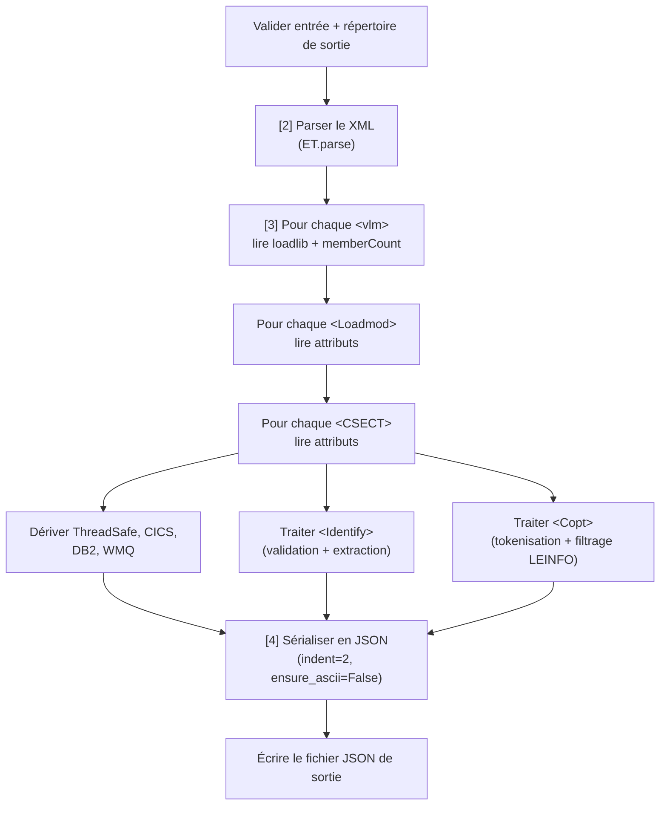

# Règles métier — `build_json.py`

> **Rôle du script :** convertir le fichier XML VLM nettoyé et reformaté en
> un fichier JSON structuré, exploitable par `export_csv.sh` via `jq`.
> C'est la dernière étape de transformation avant l'export en CSV.

---

## Sommaire

1. [Contexte et glossaire](#1-contexte-et-glossaire)
2. [Vue d'ensemble du traitement](#2-vue-densemble-du-traitement)
2b. [Paramètres de la ligne de commande](#2b-paramètres-de-la-ligne-de-commande)
3. [Format du fichier d'entrée](#3-format-du-fichier-dentrée)
4. [Format du fichier de sortie](#4-format-du-fichier-de-sortie)
5. [Règles de conversion XML → JSON](#5-règles-de-conversion-xml--json)
6. [Dérivation des champs booléens par CSECT](#6-dérivation-des-champs-booléens-par-csect)
7. [Tokenisation des options de compilation (Copt)](#7-tokenisation-des-options-de-compilation-copt)
8. [Gestion des erreurs et codes de sortie](#8-gestion-des-erreurs-et-codes-de-sortie)
9. [Exemples concrets](#9-exemples-concrets)

---

## 1. Contexte et glossaire

`build_json.py` est l'étape 3 du pipeline. Elle parse l'arbre XML
(Loadlib → Loadmod → CSECT) et produit un fichier JSON structuré
exploitable par `jq` ou `export_csv.sh`.

!!! tip "Vocabulaire"
    Pour les définitions de Loadlib, Loadmod, CSECT, COPT, LEINFO,
    Identify, CICS, DB2 et WMQ, voir le [glossaire métier z/OS](./../glossaire.md).

---

## 2. Vue d'ensemble du traitement



---

## 2b. Paramètres de la ligne de commande

| Paramètre           | Obligatoire | Valeur par défaut  | Description                                     |
| ------------------- | ----------- | ------------------ | ----------------------------------------------- |
| `-f` / `--file`     | non         | `clean_vlm.xml`    | Fichier XML d'entrée produit par `reformat_copt.py` |
| `-o` / `--output`   | non         | `vlm.json`         | Fichier JSON de sortie                          |
| `-e` / `--encoding` | non         | `iso8859-1`        | Encodage du fichier XML d'entrée                |

> L'encodage par défaut `iso8859-1` est hérité du script précédent mais, en
> pratique, le fichier XML produit par `reformat_copt.py` est toujours en UTF-8.
> Il est recommandé de passer `-e utf-8` explicitement (c'est ce que fait
> `pipeline.py`).

---

## 3. Format du fichier d'entrée

- **Encodage :** UTF-8 par défaut (paramétrable via `-e`).
- **Structure :** XML bien formé produit par `reformat_copt.py`.
- **Hiérarchie :** `<root>` → `<vlm>` → `<Loadmod>` → `<CSECT>` → (`<Identify>`, `<Copt>`).

Exemple de fragment d'entrée :

```xml
<?xml version='1.0' encoding='utf-8'?>
<root>
  <vlm loadlib="MY.LOAD.LIB">
    <Loadmod Name="MYPGM" Linkedon="2025/06/01" Linkedat="10:32:00"
             Linkedby="IEWL" EPA="00000000" MSize="000080" TTR="000001"
             SSI="" AC="0" AM="31" RM="24">
      <CSECT Name="MYPGM" Type="SD" Class="B_TEXT" Address="00000000"
             Size="000060" ARMODE="31" Compiler1="COBOL" Date="2025/06/01">
        <Identify Val="MYPREFIX/ABCD1234/DY012345678"/>
        <Copt Val="RENT NOOPT CSECT(CODE,ACCPRINT) LEINFO=(1)"/>
      </CSECT>
      <CSECT Name="CEEUOPT" Type="SD" Class="B_TEXT" Address="000060"
             Size="000010" ARMODE="31" Compiler1="COBOL" Date="2025/06/01"/>
    </Loadmod>
    <memberCount value="1"/>
  </vlm>
</root>
```

---

## 4. Format du fichier de sortie

- **Encodage :** UTF-8 (`ensure_ascii=False`).
- **Structure :** tableau JSON de Loadlibs, chacune contenant ses Loadmods,
  chacun ses CSECTs.
- **Indentation :** 2 espaces.

Structure schématique :

```json
[
  {
    "Loadlib": "MY.LOAD.LIB",
    "MemberCount": 1,
    "Loadmods": [
      {
        "Name": "MYPGM",
        "Linkedon": "2025/06/01",
        "Linkedat": "10:32:00",
        "Linkedby": "IEWL",
        "EPA": "00000000",
        "MSize": "000080",
        "TTR": "000001",
        "SSI": "",
        "AC": "0",
        "AM": "31",
        "RM": "24",
        "CSECTs": [
          {
            "Name": "MYPGM",
            "Type": "SD",
            "Class": "B_TEXT",
            "Address": "00000000",
            "Size": "000060",
            "RMODE": "31",
            "Compiler1": "COBOL",
            "Date": "2025/06/01",
            "ThreadSafe": false,
            "CICS": false,
            "DB2": false,
            "WMQ": false,
            "Identify": "DY012345678",
            "Copt": ["RENT", "NOOPT", "CSECT(CODE,ACCPRINT)"]
          }
        ]
      }
    ]
  }
]
```

> **Note :** `LEINFO=(1)` est absent de `Copt` — il est filtré lors de la
> tokenisation (voir §7). L'attribut XML `ARMODE` est renommé `RMODE` en JSON.

---

## 5. Règles de conversion XML → JSON

### 5.1 Niveau Loadlib (`<vlm>`)

**Règle :** chaque élément `<vlm>` produit une entrée JSON avec trois champs :

| Champ JSON    | Source XML                              | Comportement si absent |
| ------------- | --------------------------------------- | ---------------------- |
| `Loadlib`     | Attribut `loadlib` de `<vlm>`           | `null`                 |
| `MemberCount` | Attribut `value` de `<memberCount>`     | `0`                    |
| `Loadmods`    | Liste des `<Loadmod>` enfants de `<vlm>`| `[]`                   |

```python
# src/build_json.py — dans xml_to_json()
for vlm in root.findall("vlm"):
    loadlib: str | None = vlm.get("loadlib")
    member_count_elem: ET.Element | None = vlm.find("memberCount")
    if member_count_elem is not None:
        # .get("value") retourne str | None ; or "0" substitue None par "0"
        member_count: int = int(member_count_elem.get("value") or "0")
    else:
        member_count = 0
    loadmods: list[dict[str, Any]] = []
    # ... parcours des Loadmod ...
    vlm_list.append(
        {
            "Loadlib": loadlib,
            "MemberCount": member_count,
            "Loadmods": loadmods,
        }
    )
```

---

### 5.2 Niveau Loadmod (`<Loadmod>`)

**Règle :** chaque `<Loadmod>` produit un dictionnaire dont les champs sont
directement issus des attributs XML éponymes, à l'exception de `CSECTs` qui
est une liste construite dynamiquement.

| Champ JSON | Attribut XML source |
| ---------- | ------------------- |
| `Name`     | `Name`              |
| `Linkedon` | `Linkedon`          |
| `Linkedat` | `Linkedat`          |
| `Linkedby` | `Linkedby`          |
| `EPA`      | `EPA`               |
| `MSize`    | `MSize`             |
| `TTR`      | `TTR`               |
| `SSI`      | `SSI`               |
| `AC`       | `AC`                |
| `AM`       | `AM`                |
| `RM`       | `RM`                |
| `CSECTs`   | _(liste construite)_ |

```python
# src/build_json.py — dans xml_to_json()
for loadmod in vlm.findall("Loadmod"):
    loadmod_data: dict[str, Any] = {
        "Name": loadmod.get("Name"),
        "Linkedon": loadmod.get("Linkedon"),
        "Linkedat": loadmod.get("Linkedat"),
        "Linkedby": loadmod.get("Linkedby"),
        "EPA": loadmod.get("EPA"),
        "MSize": loadmod.get("MSize"),
        "TTR": loadmod.get("TTR"),
        "SSI": loadmod.get("SSI"),
        "AC": loadmod.get("AC"),
        "AM": loadmod.get("AM"),
        "RM": loadmod.get("RM"),
        "CSECTs": [],
    }
```

---

### 5.3 Niveau CSECT (`<CSECT>`)

**Règle :** chaque `<CSECT>` produit un dictionnaire dont les champs proviennent
des attributs XML, avec une exception : l'attribut XML `ARMODE` est renommé
`RMODE` en JSON.

| Champ JSON  | Attribut XML source | Remarque                          |
| ----------- | ------------------- | --------------------------------- |
| `Name`      | `Name`              |                                   |
| `Type`      | `Type`              |                                   |
| `Class`     | `Class`             |                                   |
| `Address`   | `Address`           |                                   |
| `Size`      | `Size`              |                                   |
| `RMODE`     | `ARMODE`            | **Renommage** ARMODE → RMODE      |
| `Compiler1` | `Compiler1`         |                                   |
| `Date`      | `Date`              |                                   |

```python
# src/build_json.py — dans xml_to_json()
csect_data: dict[str, Any] = {
    "Name": csect.get("Name"),
    "Type": csect.get("Type"),
    "Class": csect.get("Class"),
    "Address": csect.get("Address"),
    "Size": csect.get("Size"),
    "RMODE": csect.get("ARMODE"),   # renommage ARMODE → RMODE
    "Compiler1": csect.get("Compiler1"),
    "Date": csect.get("Date"),
}
```

---

### 5.4 Champ `Identify`

**Règle :** si une balise `<Identify>` est présente dans la CSECT, son attribut
`Val` est validé par l'expression régulière suivante :

```
^[A-Za-z0-9_@à]{1,8}/[A-Za-z0-9]{1,8}/(DY|DA)[A-Za-z0-9]{2}[0-9]{6}$
```

Décomposée :

| Segment         | Format attendu                               | Exemple          |
| --------------- | -------------------------------------------- | ---------------- |
| Préfixe         | 1–8 caractères alphanumériques, `_`, `@`, `à` | `MYPREFIX`       |
| `/`             | Séparateur                                   |                  |
| Hash            | 1–8 caractères alphanumériques               | `ABCD1234`       |
| `/`             | Séparateur                                   |                  |
| Identifiant     | `DY` ou `DA` + 2 alphanum + 6 chiffres       | `DY012345678`    |

- Si la validation réussit : la valeur est découpée sur `/` et seule la
  **dernière partie** (l'identifiant) est conservée dans le champ `Identify`.
- Si la validation échoue (format incorrect) : `Identify` vaut `null`.
- Si la **balise `<Identify>` est absente** : le champ `Identify` **n'est pas
  présent du tout** dans le dictionnaire JSON (ni clé, ni `null`). Ce
  comportement diffère de la validation échouée où la clé est présente avec
  `null`.

> **Différence clé absente vs `null`** : en JSON, `{"Name": "MYPGM"}` (pas de
> clé `Identify`) et `{"Name": "MYPGM", "Identify": null}` sont différents.
> Le code ne crée la clé que si la balise existe. Les consommateurs du JSON
> (ex. `export_csv.sh`) doivent utiliser `.Identify // null` en jq pour gérer
> les deux cas.

```python
# src/build_json.py — dans xml_to_json()
pattern: str = (
    r"^[A-Za-z0-9_@à]{1,8}"
    r"/"
    r"[A-Za-z0-9]{1,8}"
    r"/"
    r"(DY|DA)[A-Za-z0-9]{2}[0-9]{6}$"
)

identify_elem: ET.Element | None = csect.find("Identify")
if identify_elem is not None:
    val: str | None = identify_elem.attrib.get("Val")
    if val and re.match(pattern, val):
        i: list[str] = val.split("/")
        package: str = i[-1]
        csect_data["Identify"] = package
    else:
        csect_data["Identify"] = None
```

---

## 6. Dérivation des champs booléens par CSECT

Quatre champs booléens sont dérivés automatiquement à partir du **nom de la
CSECT**. Ils permettent d'identifier les dépendances middleware d'un programme
sans analyse manuelle.

### 6.1 `ThreadSafe`

**Règle :** `true` si et seulement si le nom de la CSECT est exactement
`CEEUOPT`.

> **Pourquoi ?** `CEEUOPT` est le module LE d'options utilisateur qui active
> notamment la sécurité multi-thread dans IBM Enterprise COBOL.

```python
# src/build_json.py
csect_data["ThreadSafe"] = csect_data["Name"] == "CEEUOPT"
```

---

### 6.2 `CICS`

**Règle :** `true` si et seulement si le nom de la CSECT est exactement
`DFHECI`.

> **Pourquoi ?** `DFHECI` est le stub d'interface CICS inséré par l'éditeur de
> liens lorsque le programme utilise des appels CICS (`EXEC CICS`).

```python
# src/build_json.py
csect_data["CICS"] = csect_data["Name"] == "DFHECI"
```

---

### 6.3 `DB2`

**Règle :** `true` si le nom de la CSECT contient au moins l'une des
sous-chaînes suivantes :

| Sous-chaîne | Stub DB2 correspondant              |
| ----------- | ----------------------------------- |
| `DSNCLI`    | Call-level interface DB2            |
| `DSNELI`    | Stub embedded SQL DB2               |
| `DSNULI`    | Stub utilisation générale DB2       |

```python
# src/build_json.py
csect_data["DB2"] = any(
    sub in csect_data["Name"] for sub in ("DSNCLI", "DSNELI", "DSNULI")
)
```

---

### 6.4 `WMQ`

**Règle :** `true` si le nom de la CSECT contient au moins l'une des
sous-chaînes suivantes :

| Sous-chaîne  | Stub WMQ correspondant                        |
| ------------ | --------------------------------------------- |
| `DFHMQSTB`   | Stub MQ CICS                                  |
| `CSQBSTUB`   | Stub batch MQ                                 |
| `CSQBRRSI`   | Stub reconnexion MQ                           |
| `CSQBRSTB`   | Stub reconnexion MQ (variante)                |
| `CSQCSTUB`   | Stub client MQ                                |
| `CSQQSTUB`   | Stub quiescing MQ                             |
| `CSQXSTUB`   | Stub exit MQ                                  |
| `CSQASTUB`   | Stub administraction MQ                       |

```python
# src/build_json.py
csect_data["WMQ"] = any(
    sub in csect_data["Name"]
    for sub in (
        "DFHMQSTB",
        "CSQBSTUB",
        "CSQBRRSI",
        "CSQBRSTB",
        "CSQCSTUB",
        "CSQQSTUB",
        "CSQXSTUB",
        "CSQASTUB",
    )
)
```

---

## 7. Tokenisation des options de compilation (Copt)

### 7.1 Problème à résoudre

Un simple `split()` sur `Copt@Val` casserait les options contenant des espaces
internes à des parenthèses, par exemple `CSECT(CODE, MCONFIG)` serait découpé
en deux tokens invalides `CSECT(CODE,` et `MCONFIG)`.

### 7.2 Suppression de LEINFO / NON-LEINFO

**Règle :** avant toute normalisation, les tokens `LEINFO=(...)` **et**
`NON-LEINFO=(...)` sont supprimés de la chaîne. La suppression utilise une regex
non-greedy avec `re.DOTALL` pour gérer les `LEINFO` multi-lignes. Le préfixe
optionnel `(?:NON-)?` garantit que `NON-LEINFO=(N)` est retiré **en entier** :
sans lui, seul `LEINFO=(N)` serait supprimé et le résidu `NON-` resterait comme
fausse option.

**Cas particulier :** si `CDbiPathBase()` apparaît à l'intérieur d'un bloc
`LEINFO=(...)` ou `NON-LEINFO=(...)`, il est retiré au préalable pour éviter de
perturber la regex de suppression.

```python
# src/build_json.py — dans split_copt_options()

# Pré-nettoyage : supprime CDbiPathBase() à l'intérieur d'un (NON-)LEINFO
raw = re.sub(r"(\b(?:NON-)?LEINFO=\([^)]*)CDbiPathBase\(\)", r"\1", raw)

# Suppression complète de LEINFO=(...) et NON-LEINFO=(...), y compris multi-lignes
raw_without_leinfo: str = re.sub(
    r"\b(?:NON-)?LEINFO=\(.*?\)",
    "",
    raw,
    flags=re.DOTALL,
)
```

> **Pourquoi supprimer LEINFO ici ?** `build_json.py` reçoit le XML produit par
> `reformat_copt.py`. Selon le mode utilisé lors du reformattage, LEINFO peut
> être présent sous forme de placeholder `LEINFO=(N)` / `NON-LEINFO=(N)` ou sous
> forme originale. Dans tous les cas, cette métadonnée LE n'est pas une option
> de compilation COBOL et ne doit pas figurer dans le tableau `Copt` du JSON
> final.

### 7.3 Algorithme de tokenisation

**Règle :** après suppression de LEINFO et normalisation des blancs, la chaîne
est parcourue caractère par caractère avec un compteur de profondeur de
parenthèses :

- `(` incrémente la profondeur.
- `)` décrémente la profondeur (plancher à 0 pour protéger contre un XML malformé).
- Un espace à profondeur `0` termine le token courant.
- Un espace à profondeur `> 0` (dans des parenthèses) est **supprimé**,
  ce qui normalise `CSECT(CODE, MCONFIG)` en `CSECT(CODE,MCONFIG)`.

```python
# src/build_json.py — split_copt_options()
def split_copt_options(raw: str) -> list[str]:
    # Pré-nettoyage CDbiPathBase à l'intérieur de (NON-)LEINFO
    raw = re.sub(r"(\b(?:NON-)?LEINFO=\([^)]*)CDbiPathBase\(\)", r"\1", raw)

    # Suppression de LEINFO=(...) et NON-LEINFO=(...)
    raw_without_leinfo: str = re.sub(
        r"\b(?:NON-)?LEINFO=\(.*?\)",
        "",
        raw,
        flags=re.DOTALL,
    )

    # Normalisation des blancs
    normalized: str = " ".join(raw_without_leinfo.split())

    tokens: list[str] = []
    current: list[str] = []
    paren_depth: int = 0

    for ch in normalized:
        if ch == "(":
            paren_depth += 1
            current.append(ch)
            continue

        if ch == ")":
            # Protège contre les ')' en excès dans un XML malformé.
            if paren_depth > 0:
                paren_depth -= 1
            current.append(ch)
            continue

        # Espace à l'intérieur des parenthèses : supprimé.
        if ch.isspace() and paren_depth > 0:
            continue

        # Espace hors parenthèses : fin du token courant.
        if ch.isspace() and paren_depth == 0:
            if current:
                tokens.append("".join(current))
                current = []
            continue

        current.append(ch)

    if current:
        tokens.append("".join(current))

    return tokens
```

---

## 8. Gestion des erreurs et codes de sortie

### 8.1 Validation avant traitement

| Vérification                                        | Condition d'échec       | Code de sortie |
| --------------------------------------------------- | ----------------------- | -------------- |
| Le fichier XML d'entrée existe                      | Fichier absent          | `2`            |
| Le répertoire de sortie existe et est inscriptible  | Répertoire absent ou RO | `2`            |

La vérification des droits d'écriture repose sur la création d'un fichier
temporaire `.__vlm_write_test__` immédiatement supprimé.

```python
# src/build_json.py — dans main()
input_path: Path = Path(input_file)
if not input_path.is_file():
    LOGGER.error("Error: input file '%s' does not exist.", input_file)
    sys.exit(2)

output_dir: Path = (
    output_path.parent if output_path.parent != Path("") else Path(".")
)
if not output_dir.exists() or not output_dir.is_dir():
    LOGGER.error(
        "Error: output directory '%s' does not exist or is not a directory.",
        output_dir,
    )
    sys.exit(2)
try:
    testfile = output_dir / ".__vlm_write_test__"
    with testfile.open("w"):
        pass
    testfile.unlink()
except Exception:
    LOGGER.error("Error: output directory '%s' is not writable.", output_dir)
    sys.exit(2)
```

### 8.2 Validation XML

**Règle :** avant la conversion, le script appelle `check_xml_well_formed()` qui
tente un `ET.parse()`. Si le fichier est invalide, un message `ERROR` est émis
dans les logs.

**Comportement permissif :** le résultat de la validation n'est pas utilisé pour
bloquer le traitement. La fonction principale `xml_to_json()` recharge le fichier
immédiatement après avec son propre `ET.parse()`. Si le XML est invalide, c'est
ce deuxième appel qui lèvera une `ParseError` non capturée, interrompant le
script.

> **En pratique :** si le XML est invalide, le script affiche le message de
> validation puis échoue sur `xml_to_json()`. Il n'y a pas de code de sortie
> dédié pour ce cas dans `main()` (le crash Python retourne en général `1`).

```python
# src/build_json.py — check_xml_well_formed()
def check_xml_well_formed(xml_path: str) -> bool:
    try:
        ET.parse(xml_path)
        LOGGER.debug("%s is well-formed.", xml_path)
        return True
    except ET.ParseError as e:
        LOGGER.error("XML syntax error in %s: %s", xml_path, e)
        return False
```

### 8.3 Tableau récapitulatif des codes de sortie

| Code | Signification                                                                           |
| ---- | --------------------------------------------------------------------------------------- |
| `0`  | Succès — le fichier JSON a été produit correctement.                                    |
| `2`  | Erreur fichier/répertoire — fichier d'entrée absent, répertoire de sortie inaccessible. |

---

## 9. Exemples concrets

### 9.1 Dérivation des booléens

| Nom CSECT      | `ThreadSafe` | `CICS`  | `DB2`   | `WMQ`   |
| -------------- | ------------ | ------- | ------- | ------- |
| `MYPGM`        | `false`      | `false` | `false` | `false` |
| `CEEUOPT`      | `true`       | `false` | `false` | `false` |
| `DFHECI`       | `false`      | `true`  | `false` | `false` |
| `DSNCLIMYMOD`  | `false`      | `false` | `true`  | `false` |
| `CSQBSTUBMOD`  | `false`      | `false` | `false` | `true`  |

---

### 9.2 Tokenisation de Copt — cas standard

Entrée `Copt@Val` :

```
RENT NOOPT CSECT(CODE, ACCPRINT) NOALPHA
```

Après `split_copt_options()` :

```python
["RENT", "NOOPT", "CSECT(CODE,ACCPRINT)", "NOALPHA"]
```

> L'espace après la virgule dans `CSECT(CODE, ACCPRINT)` est supprimé car la
> profondeur de parenthèses est `> 0` au moment de sa lecture.

---

### 9.3 Tokenisation de Copt — filtrage de LEINFO / NON-LEINFO

Entrée `Copt@Val` (placeholder produit par `reformat_copt.py`) :

```
RENT LEINFO=(1) NOOPT NON-LEINFO=(2) NOALPHA
```

Après suppression de `LEINFO=(...)` **et** `NON-LEINFO=(...)` :

```
RENT  NOOPT  NOALPHA
```

Après normalisation des blancs et tokenisation :

```python
["RENT", "NOOPT", "NOALPHA"]
```

> `NON-LEINFO=(2)` est retiré en entier grâce au préfixe `(?:NON-)?` de la
> regex. Le mot `NOTLEINFO` (sans tiret) serait au contraire conservé, car la
> limite de mot `\b` ne s'applique pas à l'intérieur d'un identifiant.

---

### 9.4 Tokenisation de Copt — LEINFO multi-lignes

Entrée brute (XML non reformaté, avec LEINFO volumineux) :

```
RENT LEINFO=(LE,NOLONGNAME,
RMODE=ANY,AFP(NOVOLATILE)) NOOPT
```

Après `re.sub(r"\b(?:NON-)?LEINFO=\(.*?\)", "", raw, flags=re.DOTALL)` :

```
RENT  NOOPT
```

Après normalisation :

```python
["RENT", "NOOPT"]
```

---

### 9.5 Validation et extraction de `Identify`

| `Val` dans `<Identify>` | Résultat `Identify` en JSON | Raison                            |
| ----------------------- | --------------------------- | --------------------------------- |
| `MYPREFIX/ABCD1234/DY012345678` | `"DY012345678"` | Valide — dernière partie extraite |
| `PREFIX/HASH/DA990000001`       | `"DA990000001"` | Valide — préfixe `DA` accepté     |
| `TOOLONG_PREFIX/HASH/DY000001`  | `null`          | Préfixe > 8 caractères            |
| `PREFIX/HASH/XX000001`          | `null`          | Identifiant ne commence pas par `DY`/`DA` |
| _(balise absente)_              | _(champ absent)_ | `Identify` n'est pas ajouté au dict |

---

### 9.6 Exemple de sortie JSON complète

Entrée XML :

```xml
<vlm loadlib="MY.LOAD.LIB">
  <Loadmod Name="MYPGM" Linkedon="2025/06/01" Linkedat="10:32:00"
           Linkedby="IEWL" EPA="00000000" MSize="000080" TTR="000001"
           SSI="" AC="0" AM="31" RM="24">
    <CSECT Name="MYPGM" Type="SD" Class="B_TEXT" Address="00000000"
           Size="000060" ARMODE="31" Compiler1="COBOL" Date="2025/06/01">
      <Identify Val="PRF/ABCD1234/DY012345678"/>
      <Copt Val="RENT NOOPT LEINFO=(1)"/>
    </CSECT>
    <CSECT Name="CEEUOPT" Type="SD" Class="B_TEXT" Address="000060"
           Size="000010" ARMODE="31" Compiler1="COBOL" Date="2025/06/01"/>
  </Loadmod>
  <memberCount value="1"/>
</vlm>
```

Sortie JSON correspondante :

```json
[
  {
    "Loadlib": "MY.LOAD.LIB",
    "MemberCount": 1,
    "Loadmods": [
      {
        "Name": "MYPGM",
        "Linkedon": "2025/06/01",
        "Linkedat": "10:32:00",
        "Linkedby": "IEWL",
        "EPA": "00000000",
        "MSize": "000080",
        "TTR": "000001",
        "SSI": "",
        "AC": "0",
        "AM": "31",
        "RM": "24",
        "CSECTs": [
          {
            "Name": "MYPGM",
            "Type": "SD",
            "Class": "B_TEXT",
            "Address": "00000000",
            "Size": "000060",
            "RMODE": "31",
            "Compiler1": "COBOL",
            "Date": "2025/06/01",
            "ThreadSafe": false,
            "CICS": false,
            "DB2": false,
            "WMQ": false,
            "Identify": "DY012345678",
            "Copt": ["RENT", "NOOPT"]
          },
          {
            "Name": "CEEUOPT",
            "Type": "SD",
            "Class": "B_TEXT",
            "Address": "000060",
            "Size": "000010",
            "RMODE": "31",
            "Compiler1": "COBOL",
            "Date": "2025/06/01",
            "ThreadSafe": true,
            "CICS": false,
            "DB2": false,
            "WMQ": false
          }
        ]
      }
    ]
  }
]
```
