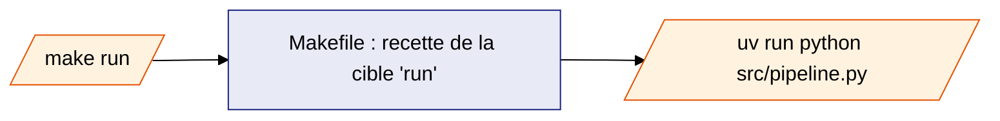

# Le Makefile — toutes les commandes du projet

> **Cette page ne suppose aucune connaissance préalable de l'outil `make`.**
> La section 1 explique le principe avant de détailler chaque commande.

---

## 1. Qu'est-ce qu'un Makefile ?

Un fichier nommé `Makefile`, placé à la racine du projet, contient une liste
de **raccourcis** — appelés *cibles* (« targets » en anglais). Chaque
raccourci porte un nom court et déclenche une ou plusieurs commandes.

**Analogie :** c'est un menu de restaurant. Plutôt que de décrire en
cuisine toutes les étapes de préparation, on commande un plat par son nom —
la recette est déjà écrite.

Sans Makefile, lancer le pipeline demande de taper :

```bash
uv run python src/pipeline.py
```

Avec le Makefile, la même action s'obtient par :

```bash
make run
```

`run` est le nom de la cible. Le fichier `Makefile` contient la "recette"
associée — ici, exactement la commande ci-dessus.



---

## 2. Lister les commandes disponibles

```bash
make help
```

ou simplement :

```bash
make
```

`make` sans argument exécute la cible par défaut du projet, qui est
justement `help`. Elle affiche la liste de toutes les cibles avec une
courte description et les variables qu'elles acceptent.

---

## 3. Vue d'ensemble des cibles

| Cible | Rôle | Détails |
|---|---|---|
| `run` | Lance le pipeline VLM | §4 |
| `query` | Exporte le JSON vers CSV | §5 — voir aussi le [Guide export_csv.sh](../export_csv/guide.md) |
| `log-level` | Change le niveau de log dans `config.toml` | §6.1 |
| `log` | Ouvre le journal du pipeline avec `less` | §6.2 |
| `clean` | Supprime les fichiers générés et les caches | §7 |
| `docker-build` | Construit l'image Docker `vlm-pipeline` | §8.1 |
| `docker-run` | Exécute une cible `make` dans le conteneur | §8.2 |
| `docs` | Lance la documentation MkDocs (premier plan) | §9 |
| `docs-start` | Lance la documentation MkDocs (arrière-plan) | §9 |
| `docs-stop` | Arrête la documentation MkDocs | §9 |
| `docs-build` | Compile la documentation en site HTML statique | §9 |
| `help` | Affiche cette liste (cible par défaut) | §2 |

---

## 4. Pipeline — `make run`

```bash
make run
```

Lance les 4 étapes du pipeline dans l'ordre (voir la
[vue d'ensemble](../index.md)).

**Exécuter seulement certaines étapes** avec la variable `STEPS` :

```bash
make run STEPS=3        # uniquement l'étape 3 (build_json.py)
make run STEPS=2-4      # étapes 2 à 4
make run STEPS=extract  # alias de l'étape 4 (extract_copt.py)
```

!!! note "Qu'est-ce qu'une « variable Makefile » ?"
    `STEPS` est un mot que l'on peut faire suivre de `=valeur` après le nom
    de la cible. Écrire `make run STEPS=3` revient à exécuter
    `uv run python src/pipeline.py 3` : la valeur passée après `STEPS=` est
    transmise telle quelle au script Python.

---

## 5. Export CSV — `make query`

```bash
make query
```

Équivaut à lancer `script/export_csv.sh` en mode global (`-g`) sur
`datas/vlm.json`, et écrit le résultat dans `datas/export.csv`.

**Variables disponibles :**

| Variable | Valeur par défaut | Rôle |
|---|---|---|
| `QUERY_INPUT` | `datas/vlm.json` | Fichier JSON en entrée |
| `QUERY_OUTPUT` | `datas/export.csv` | Fichier CSV en sortie |
| `QUERY_MODE` | `-g` | Mode : `-g` (global), `-p` (options), `-c` (compilateur) |
| `QUERY_DATE` | _(vide)_ | Filtre de date optionnel `yyyy/mm/dd` |

```bash
make query QUERY_MODE=-p
make query QUERY_MODE=-c QUERY_OUTPUT=datas/compilers.csv
make query QUERY_DATE=2026/01/01
make query QUERY_MODE=-p QUERY_OUTPUT=datas/opts.csv QUERY_DATE=2026/01/01
```

Pour le détail des trois modes et le format de sortie, voir le
[Guide export_csv.sh](../export_csv/guide.md).

---

## 6. Configuration et journal

### 6.1 `make log-level` — changer le niveau de log

Le pipeline écrit son déroulement dans `datas/pipeline.log`. La quantité de
détails écrits dépend du **niveau de log**, défini dans `config.toml`
(`[logging] level`).

| Niveau | Quand l'utiliser |
|---|---|
| `DEBUG` | Diagnostic détaillé — toutes les étapes internes |
| `INFO` | Niveau par défaut — déroulement normal du pipeline |
| `WARNING` | Seulement les anomalies non bloquantes |
| `ERROR` | Seulement les erreurs |

```bash
make log-level LOG_LEVEL=DEBUG
```

Cette commande modifie directement la ligne `level = "..."` de
`config.toml`. Toute valeur autre que `DEBUG`, `INFO`, `WARNING` ou `ERROR`
est refusée avec un message d'erreur.

### 6.2 `make log` — consulter le journal

```bash
make log
```

Ouvre `datas/pipeline.log` avec l'outil `less`, positionné en fin de
fichier (les événements les plus récents apparaissent donc directement).

!!! tip "Se déplacer dans `less`"
    - `q` : quitter
    - `↑` / `↓` (ou `k` / `j`) : ligne précédente / suivante
    - `/motif` puis ↵ : rechercher `motif` (touche `n` pour l'occurrence suivante)
    - `G` : aller à la fin du fichier, `g` : revenir au début

Si `datas/pipeline.log` n'existe pas encore, la commande indique de lancer
`make run` au préalable.

---

## 7. Nettoyage — `make clean`

```bash
make clean
```

Supprime :

- les caches d'outils : `__pycache__/`, `.pytest_cache/`, `.ruff_cache/`,
  `.mypy_cache/`, `htmlcov/`, `.coverage`
- les fichiers produits par le pipeline : `clean_vlm.xml`,
  `clean_vlm_copt.xml`, `copt_ignored.txt`, `vlm.json`, `pipeline.log` (et
  ses fichiers de rotation), `copt/copt.csv`, `copt/loadlibs/`

!!! warning "Fichiers jamais supprimés"
    `make clean` ne touche **jamais** à `datas/vlm.xml` (le rapport brut
    d'origine) ni au répertoire `datas/copt/` lui-même — seul son contenu
    généré est supprimé.

---

## 8. Conteneurisation — `make docker-*`

Ces deux cibles pilotent Docker pour exécuter le pipeline dans un
conteneur, sans installer Python ni `uv` sur l'hôte. Voir
[Conteneurisation](../docker/index.md) pour le détail des images et des
volumes.

### 8.1 `make docker-build` — construire l'image

```bash
make docker-build
```

Construit l'image Docker `vlm-pipeline` — équivaut à
`docker build -t vlm-pipeline .`.

### 8.2 `make docker-run` — exécuter une cible dans le conteneur

```bash
make docker-run                            # = make help, dans le conteneur
make docker-run ARGS="run STEPS=2-4"
make docker-run ARGS="query QUERY_MODE=-p"
```

Le conteneur utilise `ENTRYPOINT ["make"]` : `ARGS` contient la cible (et
ses variables) à exécuter à l'intérieur du conteneur, exactement comme sur
l'hôte.

**Variables disponibles :**

| Variable | Valeur par défaut | Rôle |
|---|---|---|
| `IMAGE_NAME` | `vlm-pipeline` | Nom/tag de l'image construite et exécutée |
| `ARGS` | _(vide → `help`)_ | Cible et variables `make` à exécuter dans le conteneur |
| `DOCKER_RUN_OPTS` | `--rm -v "$(CURDIR)/datas:/app/datas"` | Options passées à `docker run` |

!!! warning "Cibles indisponibles dans le conteneur"
    `docs`, `docs-start`, `docs-stop` et `docs-build` nécessitent `uv`,
    `mkdocs` et `lsof`, absents de l'image conteneur — ce sont des outils
    de développement, hors périmètre du conteneur.

---

## 9. Documentation — `make docs*`

Ces quatre cibles pilotent le serveur MkDocs qui sert cette documentation.

| Cible | Effet |
|---|---|
| `make docs` | Lance MkDocs au premier plan (bloque le terminal) — `Ctrl+C` pour arrêter |
| `make docs-start` | Lance MkDocs en arrière-plan |
| `make docs-stop` | Arrête le serveur lancé par `docs-start` |
| `make docs-build` | Compile un site HTML statique dans `site/` |

Le port d'écoute est choisi automatiquement entre `8000` et `8050` (premier
port libre détecté).

`make docs-start` enregistre l'identifiant du processus dans `.mkdocs.pid` ;
c'est ce fichier que `make docs-stop` utilise pour retrouver et arrêter le
bon processus.
