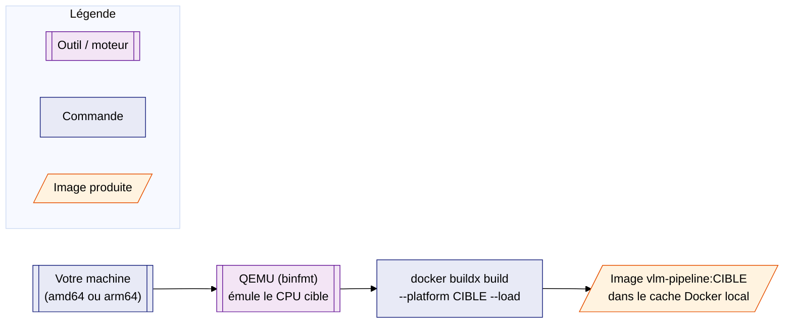

# Conteneurisation — Cross-build (construire pour une autre architecture)

> **Pour qui est cette page ?** Vous savez utiliser `make docker-build` sur
> votre machine (voir [Linux](linux.md) ou [macOS](macos.md)), mais vous
> n'avez jamais construit une image Docker pour une **autre** architecture
> que la vôtre — par exemple produire l'image `s390x` nécessaire à la zCX
> IBM Z depuis votre PC ou votre Mac. Cette page est un pas-à-pas complet,
> sans prérequis particulier.

---

## 1. Avant de commencer — les concepts

### 1.1 Qu'est-ce qu'une « architecture CPU » ?

Une **architecture CPU** (ou *plateforme*) décrit le jeu d'instructions
qu'un processeur sait exécuter. Un programme compilé pour une architecture
ne peut pas s'exécuter directement sur une autre.

| Plateforme Docker | Architecture | Exemples de machines |
|---|---|---|
| `linux/amd64` | x86_64 | PC, serveurs, CI classiques |
| `linux/arm64` | aarch64 | Mac Apple Silicon (M1 à M4), Raspberry Pi 4+ |
| `linux/s390x` | IBM Z | Mainframe IBM Z (zCX) |

### 1.2 Une image Docker est liée à une architecture

Quand vous lancez `docker build -t vlm-pipeline .`, Docker construit
l'image **pour l'architecture de la machine qui exécute la commande**. Une
image `vlm-pipeline` construite sur un Mac M4 (`linux/arm64`) ne peut pas
tourner telle quelle sur la zCX (`linux/s390x`) — il faut en construire une
autre.

C'est pour cette raison que [Vue d'ensemble §5](index.md#5-construire-limage)
indique : *« Linux → image `linux/amd64`, macOS M4 → image `linux/arm64`,
zCX → image `linux/s390x` »*. Chaque machine, en construisant normalement,
ne produit que **sa propre** architecture.

### 1.3 `buildx` et l'émulation QEMU : construire « pour ailleurs »

Pour produire une image pour une architecture différente de la vôtre,
Docker propose `docker buildx build --platform <cible>`. En interne, deux
mécanismes coexistent :

- si l'architecture cible **est** celle de votre machine → build natif,
  rien de spécial ;
- sinon → Docker exécute chaque étape du `Dockerfile` (`RUN apk add ...`,
  etc.) à travers **QEMU**, un émulateur de CPU. Le résultat est une image
  parfaitement valide pour la cible, mais le build est plus lent (chaque
  instruction est traduite à la volée).



### 1.4 `--load`, `--push`, ou rien : quelle différence ?

| Option | Effet |
|---|---|
| *(aucune)* | Construit et **vérifie** que ça compile pour la/les plateforme(s) demandée(s), mais ne range l'image nulle part d'utilisable. Pratique en CI pour valider, inutile pour obtenir une image à exécuter. |
| `--load` | Charge l'image construite dans le cache Docker local (`docker images`), comme un `docker build` classique. **N'accepte qu'une seule plateforme à la fois.** |
| `--push` | Envoie l'image vers un registre (Docker Hub, registre interne...). Accepte plusieurs plateformes (crée une image « multi-arch » sur le registre). |

Dans cette page, on utilise systématiquement `--load` avec **une seule**
plateforme par commande — c'est le plus simple pour obtenir une image
locale prête à être testée ou exportée (voir
[Déploiement zCX §2](zcx_deploiement.md#2-exporter--transférer-limage-option-a)).

---

## 2. Prérequis (les deux parcours)

| Élément | Vérification |
|---|---|
| Docker avec `buildx` (inclus par défaut depuis Docker 23 / Docker Desktop récent) | `docker buildx version` |
| Dépôt `vlm` cloné, avec le `Dockerfile` à la racine | `ls Dockerfile` |

Choisissez ensuite le parcours correspondant à votre machine :

- [Parcours A — Depuis Linux x86_64](#3-parcours-a--depuis-linux-x86_64)
  → produit les images macOS (`arm64`) et zCX (`s390x`)
- [Parcours B — Depuis macOS Apple Silicon (M4)](#4-parcours-b--depuis-macos-apple-silicon-m4)
  → produit les images Linux (`amd64`) et zCX (`s390x`)

---

## 3. Parcours A — Depuis Linux x86_64

### 3.1 Vérifier l'architecture de votre machine

```bash
uname -m
# x86_64  → correspond à "linux/amd64"
```

### 3.2 Enregistrer l'émulation QEMU (une seule fois)

Sur Linux, l'émulation multi-architecture n'est pas activée par défaut. La
commande suivante l'enregistre auprès du noyau (à refaire après un
redémarrage de la machine, selon la distribution) :

```bash
docker run --privileged --rm tonistiigi/binfmt --install all
```

Sortie attendue (extrait) :

```
installing: arm64 OK
installing: s390x OK
installing: ppc64le OK
...
```

!!! note "`--privileged` est nécessaire ici"
    Cette commande configure des gestionnaires d'exécution au niveau du
    noyau Linux de l'hôte (binfmt_misc). C'est la seule commande de cette
    page qui requiert ce mode — toutes les suivantes sont des `docker
    build`/`docker run` standards.

### 3.3 Construire l'image pour macOS Apple Silicon (`linux/arm64`)

```bash
docker buildx build --platform linux/arm64 -t vlm-pipeline:arm64 --load .
```

Le build s'exécute sous émulation QEMU — comptez quelques minutes (contre
quelques secondes en natif), `python:3.12-alpine` et `apk add` étant
téléchargés/exécutés pour `arm64`.

### 3.4 Construire l'image pour la zCX IBM Z (`linux/s390x`)

```bash
docker buildx build --platform linux/s390x -t vlm-pipeline:s390x --load .
```

Même principe — ce chemin a été testé avec succès sur ce projet (voir §5
pour les limites observées).

### 3.5 Vérifier les images obtenues

```bash
docker images vlm-pipeline
```

```
REPOSITORY     TAG       IMAGE ID       CREATED         SIZE
vlm-pipeline   latest    abc123...      5 minutes ago   22.4MB   (linux/amd64, build natif)
vlm-pipeline   arm64     def456...      2 minutes ago   21.9MB
vlm-pipeline   s390x     789abc...      1 minute ago    22.1MB
```

Pour confirmer l'architecture réelle de chaque image :

```bash
docker inspect vlm-pipeline:arm64 | grep -i architecture
# "Architecture": "arm64",

docker inspect vlm-pipeline:s390x | grep -i architecture
# "Architecture": "s390x",
```

(Optionnel) Test fonctionnel rapide sous émulation — `--entrypoint sh` est
nécessaire car l'image a `ENTRYPOINT ["make"]` :

```bash
docker run --rm --platform linux/s390x --entrypoint sh vlm-pipeline:s390x \
    -c 'python3 --version'
# Python 3.12.13
```

### 3.6 Et ensuite ?

- **Image `s390x`** → direction la zCX : voir
  [Déploiement zCX §2 et §3](zcx_deploiement.md#2-exporter--transférer-limage-option-a)
  pour l'export (`docker save`) et le transfert vers l'appliance.
- **Image `arm64`** → utile si vous distribuez l'image via un registre
  accessible aux Mac de l'équipe ; sinon, chaque utilisateur macOS peut
  simplement lancer `make docker-build` sur son propre Mac (build natif,
  voir [macOS](macos.md)).

---

## 4. Parcours B — Depuis macOS Apple Silicon (M4)

### 4.1 Vérifier l'architecture de votre machine

```bash
uname -m
# arm64  → correspond à "linux/arm64"
```

Docker Desktop pour Mac embarque déjà les binfmts QEMU nécessaires —
**pas besoin** d'installer `tonistiigi/binfmt` (cette étape est spécifique
à Linux, voir §3.2).

### 4.2 Construire l'image pour Linux x86_64 (`linux/amd64`)

```bash
docker buildx build --platform linux/amd64 -t vlm-pipeline:amd64 --load .
```

Le build est émulé (plus lent qu'un build natif `linux/arm64`), mais
produit une image `amd64` pleinement fonctionnelle.

### 4.3 Construire l'image pour la zCX IBM Z (`linux/s390x`)

```bash
docker buildx build --platform linux/s390x -t vlm-pipeline:s390x --load .
```

### 4.4 Vérifier les images obtenues

```bash
docker images vlm-pipeline
```

```
REPOSITORY     TAG       IMAGE ID       CREATED         SIZE
vlm-pipeline   latest    abc123...      5 minutes ago   21.9MB   (linux/arm64, build natif)
vlm-pipeline   amd64     def456...      2 minutes ago   22.4MB
vlm-pipeline   s390x     789abc...      1 minute ago    22.1MB
```

```bash
docker inspect vlm-pipeline:amd64 | grep -i architecture
# "Architecture": "amd64",

docker inspect vlm-pipeline:s390x | grep -i architecture
# "Architecture": "s390x",
```

(Optionnel) Test fonctionnel rapide sous émulation :

```bash
docker run --rm --platform linux/s390x --entrypoint sh vlm-pipeline:s390x \
    -c 'python3 --version'
# Python 3.12.13
```

### 4.5 Et ensuite ?

- **Image `s390x`** → voir
  [Déploiement zCX §2 et §3](zcx_deploiement.md#2-exporter--transférer-limage-option-a)
  pour l'export et le transfert vers l'appliance.
- **Image `amd64`** → à pousser sur un registre si elle doit être
  distribuée à des postes Linux ; sinon, chaque poste Linux peut lancer
  `make docker-build` lui-même (build natif, voir [Linux](linux.md)).

---

## 5. Pièges courants

!!! warning "`--load` n'accepte qu'**une seule** plateforme à la fois"
    ```bash
    # ❌ Échoue : "docker exporter does not currently support exporting manifest lists"
    docker buildx build --platform linux/amd64,linux/arm64,linux/s390x -t vlm-pipeline --load .
    ```
    Construisez **une commande par architecture**, avec un tag différent à
    chaque fois (`:amd64`, `:arm64`, `:s390x`), comme dans les parcours
    ci-dessus.

!!! warning "L'émulation QEMU est lente — ne lancez pas le pipeline complet dessus"
    Construire l'image (§3.3/3.4 ou §4.2/4.3) prend quelques minutes sous
    émulation, ce qui reste raisonnable. En revanche, **exécuter**
    `make docker-run ARGS=run` sur un gros `vlm.xml` à travers une image
    émulée peut prendre plusieurs dizaines de minutes (le traitement XML de
    `build_json.py` est gourmand en CPU). Limitez les tests sous émulation
    à des vérifications rapides (`python3 --version`, un petit fichier de
    test) — l'exécution réelle se fera nativement sur la plateforme cible.

!!! note "Le tag `latest` reste votre image native"
    `make docker-build` (sans `buildx`) continue de produire/écraser
    `vlm-pipeline:latest` pour **votre** architecture. Les images
    cross-buildées portent des tags explicites (`:arm64`, `:amd64`,
    `:s390x`) et ne remplacent rien.

---

## 6. Pour aller plus loin

- [Vue d'ensemble](index.md) — principes de l'image et du volume `datas/`
- [Linux](linux.md) / [macOS](macos.md) — utilisation au quotidien (build
  natif, `make docker-run`)
- [Présentation zCX](zcx_presentation.md) /
  [Déploiement zCX](zcx_deploiement.md) — la suite pour l'image `s390x`
