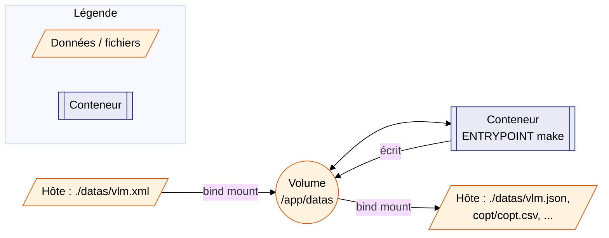

# Conteneurisation — Vue d'ensemble

> **Pourquoi un conteneur ?** Exécuter le pipeline VLM sans installer Python,
> `uv` ni leurs dépendances sur la machine hôte — seul Docker (ou un moteur
> compatible) est requis.

---

## 1. Image — principes

Le projet fournit un `Dockerfile` à la racine du dépôt, basé sur
`python:3.12-alpine`.

| Caractéristique | Valeur |
|---|---|
| Image de base | `python:3.12-alpine` (~22 Mo une fois construite) |
| Paquets ajoutés | `make`, `bash`, `jq`, `less` |
| Dépendances Python | **aucune** — `pyproject.toml` déclare `dependencies = []`, `src/` n'utilise que la stdlib |
| Architectures prises en charge par le `Dockerfile` | `linux/amd64`, `linux/arm64`, `linux/s390x` — **une image par build**, voir §5 |
| Point d'entrée | `make` (`CMD` par défaut : `help`) |
| Volume | `/app/datas` |

!!! note "Pourquoi Alpine convient ici"
    Le pipeline (`src/`) ne dépend que de la bibliothèque standard Python
    (`tomllib`, `xml.etree`, `argparse`, `logging`...). Aucune compilation
    de paquet C n'est nécessaire — les contraintes habituelles d'Alpine
    (musl vs glibc, wheels manquantes) ne s'appliquent pas.

---

## 2. Architectures supportées

`python:3.12-alpine` est disponible en multi-arch pour les trois cibles
visées par le projet :

| Plateforme | Architecture image | Page dédiée |
|---|---|---|
| Linux (poste de dev, CI, serveur) | `linux/amd64` (ou natif) | [Linux](linux.md) |
| macOS Apple Silicon (M4) | `linux/arm64` (natif via Docker Desktop) | [macOS](macos.md) |
| IBM Z sous z/OS 3.2 (zCX) | `linux/s390x` | [Présentation zCX](zcx_presentation.md) / [Déploiement](zcx_deploiement.md) |

Les trois architectures ont été validées par un build de vérification
`docker buildx build --platform linux/amd64,linux/arm64,linux/s390x` (sans
`--load` — voir l'avertissement §5) ainsi qu'un test fonctionnel (Python,
`xml.etree.ElementTree`, `tomllib`) sur une image `s390x` chargée
séparément avec `--load`, sous émulation QEMU.

---

## 3. Piloter le `Makefile` depuis l'extérieur du conteneur

### Avec `make docker-build` / `make docker-run` (recommandé)

Le `Makefile` du dépôt fournit deux cibles qui pilotent Docker depuis
l'hôte — pas besoin de connaître la syntaxe `docker run` :

```bash
make docker-build                          # construit l'image vlm-pipeline
make docker-run                            # = help (cible par défaut)
make docker-run ARGS="run STEPS=2-4"
make docker-run ARGS="query QUERY_MODE=-p"
```

| Variable | Défaut | Rôle |
|---|---|---|
| `IMAGE_NAME` | `vlm-pipeline` | Nom/tag de l'image construite et exécutée |
| `ARGS` | _(vide → `help`)_ | Cible et variables `make` à exécuter dans le conteneur |
| `DOCKER_RUN_OPTS` | `--rm -v "$(CURDIR)/datas:/app/datas"` | Options passées à `docker run` |

!!! warning "Cibles indisponibles dans le conteneur"
    `docs`, `docs-start`, `docs-stop` et `docs-build` nécessitent `uv`,
    `mkdocs` et `lsof`, qui ne sont **pas** installés dans cette image
    (ce sont des outils de développement, hors périmètre du conteneur).

### Équivalent `docker run` direct

Le conteneur utilise `ENTRYPOINT ["make"]` : tout ce qui suit le nom de
l'image sur la ligne `docker run` est transmis tel quel à `make`, exactement
comme si on tapait la commande sur l'hôte. C'est ce que fait
`make docker-run` en coulisses :

```bash
# Équivalent hôte : make help
docker run --rm vlm-pipeline help

# Équivalent hôte : make run STEPS=2-4
docker run --rm -v "$(pwd)/datas:/app/datas" vlm-pipeline run STEPS=2-4

# Équivalent hôte : make query QUERY_MODE=-p
docker run --rm -v "$(pwd)/datas:/app/datas" vlm-pipeline query QUERY_MODE=-p
```

Toutes les variables du Makefile (`STEPS`, `QUERY_MODE`, `QUERY_OUTPUT`,
`QUERY_DATE`, `LOG_LEVEL`...) restent utilisables de la même façon, que ce
soit via `ARGS="..."` ou directement après le nom de l'image.

---

## 4. Le volume `datas/`

Tous les chemins configurés dans `config.toml` (`vlm_input`, `final_json`,
`copt_csv`, `data_dir`) pointent sous `datas/`. Un seul volume, monté sur
`/app/datas`, suffit donc à la fois pour le **fichier consommé**
(`vlm.xml`, déposé par l'utilisateur avant le premier lancement) et pour
**tous les fichiers produits** par le pipeline.



!!! tip "Séparer entrée et sorties (avancé)"
    Si l'on souhaite distinguer un volume d'entrée (lecture seule) d'un
    volume de sortie, il suffit de définir `vlm_input` comme un **chemin
    absolu** dans `config.toml` (ex. `/input/vlm.xml`) — `pathlib`
    remplace alors entièrement le préfixe `PROJECT_ROOT`, sans modification
    de code. Le volume `/app/datas` continue de recevoir les fichiers
    produits.

---

## 5. Construire l'image

`docker build` (et donc `make docker-build`) produit **une seule image**,
taguée `vlm-pipeline:latest`, pour l'architecture de la machine qui exécute
la commande — ce n'est **pas** une image unique « multi-arch » contenant
les trois architectures à la fois :

```bash
make docker-build
# équivalent : docker build -t vlm-pipeline .
```

| Machine de build | Image `vlm-pipeline:latest` produite |
|---|---|
| Linux x86_64 (poste de dev, CI) | `linux/amd64` |
| macOS Apple Silicon (M4) | `linux/arm64` |
| zCX sur IBM Z | `linux/s390x` |

### Construire pour une autre architecture (cross-build)

Pour produire une image pour une architecture **différente** de celle de la
machine de build (ex. construire l'image `s390x` depuis un Mac ou un PC
x86), un pas-à-pas dédié est disponible :
[Cross-build (autres architectures)](cross_build.md). Il couvre les deux
parcours utiles à ce projet :

- depuis Linux x86_64 → produire les images macOS (`arm64`) et zCX
  (`s390x`) ;
- depuis macOS Apple Silicon (M4) → produire les images Linux (`amd64`) et
  zCX (`s390x`).

Pour la suite, voir la page correspondant à votre plateforme :
[Linux](linux.md), [macOS](macos.md) ou [IBM Z / zCX](zcx_presentation.md).
