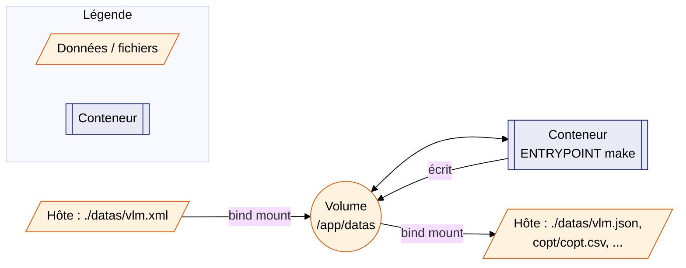

# Conteneurisation — Vue d'ensemble

> **Pourquoi un conteneur ?** Exécuter le pipeline VLM sans installer Python,
> `uv` ni leurs dépendances sur la machine hôte — seul Docker (ou un moteur
> compatible) est requis.

---

## 1. Image — principes

Le projet fournit un `Dockerfile` à la racine du dépôt, basé sur
`python:3.12-alpine`.

| Caractéristique | Valeur |
|---|---|
| Image de base | `python:3.12-alpine` (~22 Mo une fois construite) |
| Paquets ajoutés | `make`, `bash`, `jq`, `less` |
| Dépendances Python | **aucune** — `pyproject.toml` déclare `dependencies = []`, `src/` n'utilise que la stdlib |
| Architectures prises en charge par le `Dockerfile` | `linux/amd64`, `linux/arm64`, `linux/s390x` — **une image par build**, voir §5 |
| Point d'entrée | `make` (`CMD` par défaut : `help`) |
| Volume | `/app/datas` |

!!! note "Pourquoi Alpine convient ici"
    Le pipeline (`src/`) ne dépend que de la bibliothèque standard Python
    (`tomllib`, `xml.etree`, `argparse`, `logging`...). Aucune compilation
    de paquet C n'est nécessaire — les contraintes habituelles d'Alpine
    (musl vs glibc, wheels manquantes) ne s'appliquent pas.

---

## 2. Architectures supportées

`python:3.12-alpine` est disponible en multi-arch pour les trois cibles
visées par le projet :

| Plateforme | Architecture image | Page dédiée |
|---|---|---|
| Linux (poste de dev, CI, serveur) | `linux/amd64` (ou natif) | [Linux](linux.md) |
| macOS Apple Silicon (M4) | `linux/arm64` (natif via Docker Desktop) | [macOS](macos.md) |
| IBM Z sous z/OS 3.2 (zCX) | `linux/s390x` | [Présentation zCX](zcx_presentation.md) / [Déploiement](zcx_deploiement.md) |

Les trois architectures ont été validées par un build de vérification
`docker buildx build --platform linux/amd64,linux/arm64,linux/s390x` (sans
`--load` — voir l'avertissement §5) ainsi qu'un test fonctionnel (Python,
`xml.etree.ElementTree`, `tomllib`) sur une image `s390x` chargée
séparément avec `--load`, sous émulation QEMU.

---

## 3. Piloter le `Makefile` depuis l'extérieur du conteneur

### Avec `make docker-build` / `make docker-run` (recommandé)

Le `Makefile` du dépôt fournit deux cibles qui pilotent Docker depuis
l'hôte — pas besoin de connaître la syntaxe `docker run` :

```bash
make docker-build                          # construit l'image vlm-pipeline
make docker-run                            # = help (cible par défaut)
make docker-run ARGS="run STEPS=2-4"
make docker-run ARGS="query QUERY_MODE=-p"
```

| Variable | Défaut | Rôle |
|---|---|---|
| `IMAGE_NAME` | `vlm-pipeline` | Nom/tag de l'image construite et exécutée |
| `ARGS` | _(vide → `help`)_ | Cible et variables `make` à exécuter dans le conteneur |
| `DOCKER_RUN_OPTS` | `--rm -v "$(CURDIR)/datas:/app/datas"` | Options passées à `docker run` |

!!! warning "Cibles indisponibles dans le conteneur"
    `docs`, `docs-start`, `docs-stop` et `docs-build` nécessitent `uv`,
    `mkdocs` et `lsof`, qui ne sont **pas** installés dans cette image
    (ce sont des outils de développement, hors périmètre du conteneur).

---

### Référence des cibles disponibles dans le conteneur

#### `help` — afficher l'aide

Point de départ recommandé : liste toutes les cibles sans rien exécuter.

```bash
make docker-run              # ARGS vide → help par défaut
make docker-run ARGS=help    # équivalent explicite
```

---

#### `run` — lancer le pipeline

Lance les 4 étapes en séquence (`clean_report` → `reformat_copt` →
`build_json` → `extract_copt`). Un fichier `datas/vlm.xml` doit être présent
avant le premier lancement.

```bash
# Pipeline complet
make docker-run ARGS=run

# Étapes 2 à 4 seulement (vlm.xml déjà nettoyé)
make docker-run ARGS="run STEPS=2-4"

# Alias textuels équivalents
make docker-run ARGS="run STEPS=copt-extract"
make docker-run ARGS="run STEPS=json"
```

| Valeur `STEPS` | Étapes exécutées |
|---|---|
| _(vide)_ | 1 → 2 → 3 → 4 (tout) |
| `2-4` | 2 → 3 → 4 |
| `3-4` ou `json-extract` | 3 → 4 |
| `4` ou `extract` | 4 uniquement |

---

#### `query` — exporter en CSV

Interroge `datas/vlm.json` et génère un fichier CSV. Trois modes sont
disponibles selon le niveau de détail souhaité :

```bash
# Vue globale — une ligne par loadmod (défaut)
make docker-run ARGS=query

# Détail des options de compilation COPT
make docker-run ARGS="query QUERY_MODE=-p"

# Détail par compilateur
make docker-run ARGS="query QUERY_MODE=-c"

# Avec filtre sur la date de compilation
make docker-run ARGS="query QUERY_MODE=-g QUERY_DATE=2026/01/01"

# Choisir le fichier de sortie
make docker-run ARGS="query QUERY_OUTPUT=datas/mon_export.csv"
```

| Variable | Défaut | Description |
|---|---|---|
| `QUERY_MODE` | `-g` | `-g` global · `-p` options COPT · `-c` compilateur |
| `QUERY_OUTPUT` | `datas/export.csv` | Chemin du CSV produit |
| `QUERY_DATE` | _(aucun)_ | Filtre `yyyy/mm/dd` sur la date de compilation |

---

#### `log-level` — changer la verbosité des logs

Modifie le niveau de log dans `config.toml` **avant** de relancer le
pipeline. Le changement est persistant (écrit sur le volume).

```bash
make docker-run ARGS="log-level LOG_LEVEL=DEBUG"    # très verbeux
make docker-run ARGS="log-level LOG_LEVEL=INFO"     # normal (défaut)
make docker-run ARGS="log-level LOG_LEVEL=WARNING"  # avertissements seulement
make docker-run ARGS="log-level LOG_LEVEL=ERROR"    # erreurs uniquement
```

---

#### `log` — consulter les logs du pipeline

Ouvre `datas/pipeline.log` avec `less`, positionné en fin de fichier.
Nécessite que le pipeline ait été lancé au moins une fois.

```bash
make docker-run ARGS=log
```

!!! tip "Quitter `less`"
    Appuyez sur `q` pour quitter l'affichage.

---

#### `clean` — nettoyer les fichiers produits

Supprime tous les fichiers intermédiaires et de sortie. **`datas/vlm.xml`
n'est jamais supprimé.**

```bash
make docker-run ARGS=clean
```

Fichiers supprimés : `clean_vlm.xml`, `clean_vlm_copt.xml`,
`copt_ignored.txt`, `vlm.json`, `pipeline.log` et le dossier `datas/copt/`
entier.

---

### Enchaînement typique

```bash
# 1. Construire l'image (une seule fois)
make docker-build

# 2. Vérifier les cibles disponibles
make docker-run

# 3. Lancer le pipeline complet
make docker-run ARGS=run

# 4. Exporter les résultats
make docker-run ARGS=query

# 5. Consulter les logs en cas de problème
make docker-run ARGS="log-level LOG_LEVEL=DEBUG"
make docker-run ARGS=run
make docker-run ARGS=log

# 6. Nettoyer avant un nouveau passage
make docker-run ARGS=clean
```

---

### Équivalent `docker run` direct

Le conteneur utilise `ENTRYPOINT ["make"]` : tout ce qui suit le nom de
l'image sur la ligne `docker run` est transmis tel quel à `make`, exactement
comme si on tapait la commande sur l'hôte. C'est ce que fait
`make docker-run` en coulisses :

```bash
# Équivalent hôte : make help
docker run --rm vlm-pipeline help

# Équivalent hôte : make run STEPS=2-4
docker run --rm -v "$(pwd)/datas:/app/datas" vlm-pipeline run STEPS=2-4

# Équivalent hôte : make query QUERY_MODE=-p
docker run --rm -v "$(pwd)/datas:/app/datas" vlm-pipeline query QUERY_MODE=-p
```

Toutes les variables du Makefile (`STEPS`, `QUERY_MODE`, `QUERY_OUTPUT`,
`QUERY_DATE`, `LOG_LEVEL`...) restent utilisables de la même façon, que ce
soit via `ARGS="..."` ou directement après le nom de l'image.

---

## 4. Le volume `datas/`

Tous les chemins configurés dans `config.toml` (`vlm_input`, `final_json`,
`copt_csv`, `data_dir`) pointent sous `datas/`. Un seul volume, monté sur
`/app/datas`, suffit donc à la fois pour le **fichier consommé**
(`vlm.xml`, déposé par l'utilisateur avant le premier lancement) et pour
**tous les fichiers produits** par le pipeline.



!!! tip "Séparer entrée et sorties (avancé)"
    Si l'on souhaite distinguer un volume d'entrée (lecture seule) d'un
    volume de sortie, il suffit de définir `vlm_input` comme un **chemin
    absolu** dans `config.toml` (ex. `/input/vlm.xml`) — `pathlib`
    remplace alors entièrement le préfixe `PROJECT_ROOT`, sans modification
    de code. Le volume `/app/datas` continue de recevoir les fichiers
    produits.

---

## 5. Construire l'image

`docker build` (et donc `make docker-build`) produit **une seule image**,
taguée `vlm-pipeline:latest`, pour l'architecture de la machine qui exécute
la commande — ce n'est **pas** une image unique « multi-arch » contenant
les trois architectures à la fois :

```bash
make docker-build
# équivalent : docker build -t vlm-pipeline .
```

| Machine de build | Image `vlm-pipeline:latest` produite |
|---|---|
| Linux x86_64 (poste de dev, CI) | `linux/amd64` |
| macOS Apple Silicon (M4) | `linux/arm64` |
| zCX sur IBM Z | `linux/s390x` |

### Construire pour une autre architecture (cross-build)

Pour produire une image pour une architecture **différente** de celle de la
machine de build (ex. construire l'image `s390x` depuis un Mac ou un PC
x86), un pas-à-pas dédié est disponible :
[Cross-build (autres architectures)](cross_build.md). Il couvre les deux
parcours utiles à ce projet :

- depuis Linux x86_64 → produire les images macOS (`arm64`) et zCX
  (`s390x`) ;
- depuis macOS Apple Silicon (M4) → produire les images Linux (`amd64`) et
  zCX (`s390x`).

Pour la suite, voir la page correspondant à votre plateforme :
[Linux](linux.md), [macOS](macos.md) ou [IBM Z / zCX](zcx_presentation.md).

---

## 6. Sécurité — pip retiré de l'image

### Pourquoi supprimer pip ?

`pip` est l'outil d'installation de paquets Python. Il est inclus par défaut
dans l'image de base `python:3.12-alpine`, mais **il n'est jamais utilisé
dans cette image** : le pipeline ne s'appuie que sur la bibliothèque standard
Python (`xml`, `tomllib`, `argparse`…), sans aucun paquet tiers.

Laisser `pip` dans une image inutilisée est un risque de sécurité inutile.
En juin 2026, plusieurs vulnérabilités ont été identifiées dans les versions
de pip présentes dans l'image de base, grâce à **Docker Scout**.

!!! info "Comment ces CVEs ont-elles été découvertes ?"
    L'analyse a été réalisée avec la fonctionnalité **« Advanced image
    analysis »** de [Docker Scout](https://docs.docker.com/scout/), intégrée
    à Docker Desktop sur macOS Apple Silicon (M4).

    Docker Scout inspecte le contenu de l'image (paquets OS, bibliothèques
    Python, etc.) et les croise avec les bases de données de vulnérabilités
    connues (CVE). C'est accessible directement depuis l'onglet **Images**
    de Docker Desktop, sans commande supplémentaire.

    

    Pour les habitués de la ligne de commande, l'équivalent est :
    ```bash
    docker scout cves vlm-pipeline
    ```

!!! info "Qu'est-ce qu'une CVE ?"
    Une **CVE** (Common Vulnerabilities and Exposures) est un identifiant
    officiel attribué à une faille de sécurité connue. Le score **CVSS**
    (de 0 à 10) mesure sa gravité. Ces failles sont publiées publiquement
    pour que chacun puisse identifier et corriger les versions vulnérables
    de ses logiciels.

| CVE | Score CVSS | Description courte |
|---|---|---|
| CVE-2026-8643 | 5.5 | Des scripts d'entrée (`console_scripts`) peuvent être installés **hors du répertoire cible** |
| CVE-2026-6357 | 5.3 | Après l'installation d'un paquet, pip importe des modules Python qui viennent d'être installés (risque d'exécution de code non souhaité) |
| CVE-2026-3219 | 4.6 | Une archive à la fois `.tar` et `.zip` est traitée comme un ZIP, ce qui peut mener à l'installation de fichiers inattendus |
| CVE-2026-1703 | 2.0 | L'extraction d'un wheel malveillant peut écrire des fichiers **en dehors** du répertoire d'installation (path traversal) |
| CVE-2025-8869 | 5.9 | Lors de l'extraction d'une archive tar, des liens symboliques peuvent pointer **hors** du répertoire cible |

### Action prise

La ligne suivante a été ajoutée au `Dockerfile` :

```dockerfile
RUN apk add --no-cache make bash jq less \
    && pip uninstall -y pip   # (1)!
```

1. `pip uninstall -y pip` désinstalle pip de lui-même. L'option `-y` évite
   la demande de confirmation. Chaîner la commande dans le même `RUN`
   garantit qu'aucun layer intermédiaire ne conserve pip.

pip est ainsi totalement absent du système de fichiers de l'image finale —
les cinq CVEs ci-dessus ne s'appliquent plus.

### Vérifier que pip est bien absent

Après un `make docker-build`, on peut s'assurer que pip n'est plus dans
l'image avec l'une des commandes suivantes :

=== "Vérification via Python"

    ```bash
    docker run --rm --entrypoint python vlm-pipeline \
        -c "import pip; print(pip.__version__)"
    ```

    **Résultat attendu :**

    ```
    /usr/local/lib/python3.12/site-packages/pip (from <stdin>:1) does not exist
    ModuleNotFoundError: No module named 'pip'
    ```

=== "Vérification via le shell"

    ```bash
    docker run --rm --entrypoint sh vlm-pipeline \
        -c "which pip && echo 'pip PRÉSENT !' || echo 'pip absent — OK'"
    ```

    **Résultat attendu :**

    ```
    pip absent — OK
    ```

!!! success "Résultat correct"
    Toute réponse indiquant que `pip` est introuvable confirme que l'image
    est saine. Si pip apparaissait encore, reconstruire l'image avec
    `make docker-build` (sans cache si nécessaire : `docker build --no-cache
    -t vlm-pipeline .`).

---
