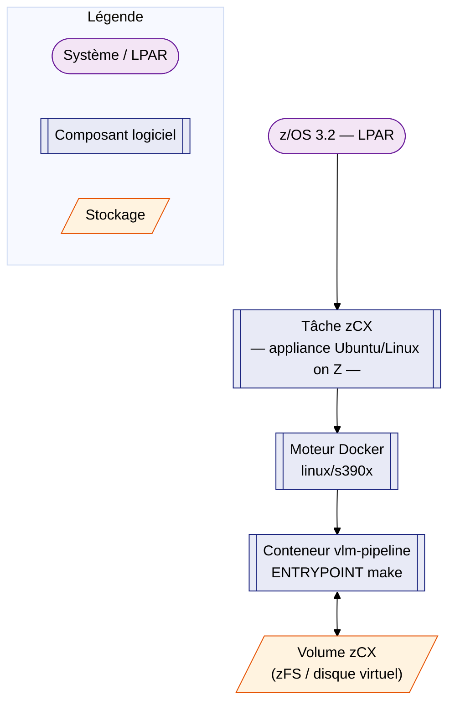

# Conteneurisation — IBM Z / zCX — Présentation

!!! warning "Page non testée en conditions réelles"
    Cette page décrit l'architecture générale de **z/OS Container Extensions
    (zCX)** et ses implications pour ce projet. Les détails opérationnels
    (réseau, stockage, accès) dépendent de la configuration de chaque site
    z/OS et doivent être validés avec l'équipe systèmes (z/OS
    sysprog/réseau) avant tout déploiement.

## 1. Qu'est-ce que zCX ?

**zCX (z/OS Container Extensions)** est une fonction de z/OS qui permet
d'exécuter des conteneurs **Docker Linux on Z** directement depuis une
tâche z/OS, sans LPAR Linux dédiée. Techniquement :

- zCX déploie une **appliance Linux** (image Ubuntu Server pour IBM Z) dans
  un espace d'adressage z/OS, démarrée et administrée comme une tâche
  z/OS classique (via z/OSMF).
- À l'intérieur de cette appliance tourne un moteur **Docker** standard,
  pilotable en SSH avec le **CLI Docker habituel** (`docker build`,
  `docker run`, `docker volume`, ...).
- L'architecture des conteneurs exécutés est donc **`linux/s390x`** —
  c'est l'architecture native d'IBM Z pour Linux, et celle des binaires
  `python:3.12-alpine` validés sur ce projet.

## 2. Implications pour `vlm-pipeline`

| Aspect | Implication |
|---|---|
| Architecture image | doit être construite (ou disposer d'un manifeste) pour `linux/s390x` |
| Contenu de l'image | déjà compatible — Alpine + stdlib Python, validés sous émulation s390x |
| Réseau | les LPAR z/OS sont généralement isolées d'Internet ; pas de `docker pull` direct depuis Docker Hub à attendre par défaut |
| Registre d'images | un registre interne accessible depuis la zCX, **ou** transfert manuel de l'image (voir [Déploiement](zcx_deploiement.md)) |
| Stockage / volumes | les volumes Docker de l'appliance résident sur le stockage alloué à la zCX (zFS) — capacité à dimensionner avec le sysprog |
| Fichier d'entrée `vlm.xml` | provient typiquement d'un export d'un rapport File Manager côté z/OS ; à transférer vers le système de fichiers de l'appliance (via SFTP/SCP une fois la zCX accessible en réseau) |

## 3. Prérequis côté z/OS (à valider avec le sysprog)

- Une **instance zCX active** (configurée via z/OSMF), avec accès SSH à
  l'appliance.
- Suffisamment d'**espace disque** alloué à l'appliance pour l'image
  (~22 Mo) et le volume `datas/` (taille du rapport VLM + sorties générées
  — peut atteindre plusieurs centaines de Mo pour un grand loadlib).
- Un moyen de **faire entrer** l'image et le fichier `vlm.xml` dans
  l'appliance : registre interne accessible en réseau, ou transfert de
  fichiers (SFTP/SCP) vers le système de fichiers Linux de l'appliance.

La suite pratique (build, transfert, exécution) est détaillée dans la page
[Déploiement](zcx_deploiement.md).
