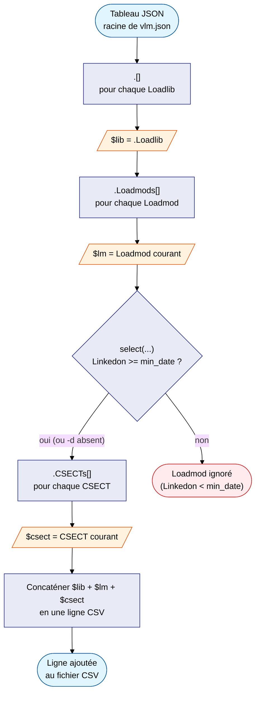
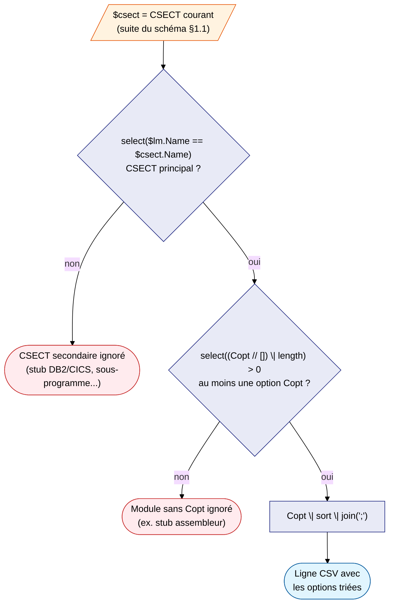
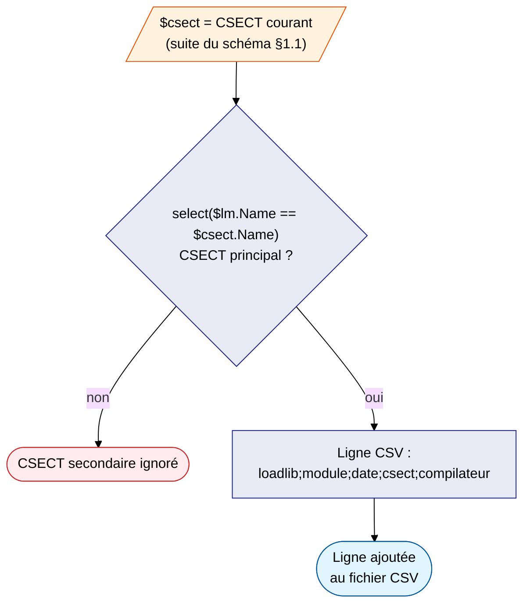

# Décryptage des filtres — export_csv.sh

> Cette page applique les concepts présentés dans le [Guide jq](jq.md) aux
> trois filtres jq réels utilisés par `export_csv.sh` (modes `-g`, `-p`,
> `-c`). Si une notation vous semble obscure (`.[]`, `as $var`, `//`,
> `select`...), reportez-vous d'abord au [Guide jq](jq.md).

---

## 1. Le filtre du mode global (`-g`)

Voici le filtre jq complet utilisé par `export_csv.sh` en mode global (`-g`),
commenté ligne par ligne :

```jq
.[]
| .Loadlib as $lib
| .Loadmods[] as $lm
| select($min_date == "" or ($lm.Linkedon >= $min_date))
| $lm.CSECTs[] as $csect
| "\($lib);"
+ "\($lm.Name);"
+ "\($lm.Linkedon);"
+ "\($csect.Name);"
+ "\($csect.Compiler1);"
+ "ThreadSafe=\($csect.ThreadSafe);"
+ "CICS=\($csect.CICS);"
+ "DB2=\($csect.DB2);"
+ "WMQ=\($csect.WMQ);"
+ "\($csect.Identify // "")"
```

| Ligne | Ce que ça fait |
|---|---|
| `.[]` | Pour chaque loadlib dans le tableau racine |
| `\| .Loadlib as $lib` | Sauvegarder le nom de la loadlib dans `$lib` |
| `\| .Loadmods[] as $lm` | Pour chaque module, sauvegarder dans `$lm` |
| `\| select(...)` | Ignorer les modules trop anciens si `-d` est actif |
| `\| $lm.CSECTs[] as $csect` | Pour chaque CSECT, sauvegarder dans `$csect` |
| `\| "\($lib);"` | Commencer la ligne CSV avec la loadlib |
| `+ "\($lm.Name);"` | Ajouter le nom du module |
| `+ "\($lm.Linkedon);"` | Ajouter la date de link-edit |
| `+ "\($csect.Name);"` | Ajouter le nom du CSECT |
| `+ "\($csect.Compiler1);"` | Ajouter le compilateur |
| `+ "ThreadSafe=\(...)"` | Ajouter les indicateurs middleware |
| `+ "\($csect.Identify // "")"` | Ajouter l'identifiant (vide si absent) |

### 1.1 Schéma du flux et des variables sauvegardées

Le schéma suivant suit le chemin des `|` de haut en bas, et montre à quel
moment chaque variable (`$lib`, `$lm`, `$csect`) est sauvegardée puis
réutilisée :



Deux choses à observer sur ce schéma :

- **Le flux des `\|`** : chaque case reçoit la sortie de la case précédente —
  c'est le chemin de haut en bas.
- **La portée des variables `as $var`** : `$lib` et `$lm` sont sauvegardés
  *avant* de descendre d'un niveau. Ils restent accessibles à toutes les
  étapes suivantes, même une fois arrivé dans le contexte `$csect` — c'est ce
  qui permet à la dernière étape d'assembler `$lib`, `$lm` et `$csect` dans la
  même ligne CSV alors qu'ils proviennent de trois niveaux différents du JSON.

**Pourquoi `$lib` et pas `.Loadlib` à la fin ?**

À la ligne `| $lm.CSECTs[] as $csect`, le contexte courant est un CSECT.
`.Loadlib` ne correspond plus à rien dans un CSECT.
Mais `$lib` a été sauvegardé avant de descendre — il reste accessible.

---

## 2. Le filtre du mode options (`-p`)

Le mode options (`-p`) reprend **exactement le même socle** que le mode
global (§1, jusqu'à `$lm.CSECTs[] as $csect` inclus), puis ajoute deux
filtres `select` supplémentaires avant de construire la ligne CSV :

```jq
.[]
| .Loadlib as $lib
| .Loadmods[] as $lm
| select($min_date == "" or ($lm.Linkedon >= $min_date))
| $lm.CSECTs[] as $csect
| select($lm.Name == $csect.Name)
| select((($csect.Copt // []) | length) > 0)
| "\($lib);"
+"\($lm.Name);"
+"\($lm.Linkedon);"
+"\($csect.Compiler1);"
+($csect.Copt | sort | join(";"))
```

Seules les lignes nouvelles par rapport au mode global :

| Ligne | Ce que ça fait |
|---|---|
| `select($lm.Name == $csect.Name)` | Ne garder que le CSECT **principal** (même nom que le module) |
| `select((($csect.Copt // []) \| length) > 0)` | Ne garder que les modules ayant **au moins une** option Copt |
| `($csect.Copt \| sort \| join(";"))` | Trier les options puis les concaténer en une seule colonne |

### 2.1 Schéma des filtres supplémentaires

Ce schéma reprend la sortie du schéma du §1.1 à partir de `$csect`, et
détaille les deux filtres ajoutés :



**Pourquoi `Copt // []` avant `length` ?**

Si `Copt` est absent du CSECT, `$csect.Copt` vaut `null`. Or `null | length`
provoque une erreur jq (`null` n'a pas de longueur). L'opérateur `//`
remplace `null` par un tableau vide `[]` *avant* d'appeler `length` —
`[] | length` vaut `0`, ce qui passe la condition `> 0` sans erreur (voir
[§13 du Guide jq](jq.md#13-compter-les-éléments--length)).

---

## 3. Le filtre du mode compiler (`-c`)

Le mode compiler (`-c`) reprend lui aussi le socle du mode global (§1),
avec **un seul** filtre supplémentaire — le même filtre "CSECT principal" que
le mode options (§2) — et une ligne CSV plus courte :

```jq
.[]
| .Loadlib as $lib
| .Loadmods[] as $lm
| select($min_date == "" or ($lm.Linkedon >= $min_date))
| $lm.CSECTs[] as $csect
| select($lm.Name == $csect.Name)
| "\($lib);"
+"\($lm.Name);"
+"\($lm.Linkedon);"
+"\($csect.Name);"
+"\($csect.Compiler1)"
```

Seules les lignes nouvelles ou différentes par rapport au mode global :

| Ligne | Ce que ça fait |
|---|---|
| `select($lm.Name == $csect.Name)` | Ne garder que le CSECT **principal** (même nom que le module) |
| `+ "\($csect.Name);"` | Ajouter le nom du CSECT (= nom du module, puisque c'est le principal) |
| `+ "\($csect.Compiler1)"` | Ajouter le compilateur — dernier champ, pas de `;` final |

### 3.1 Schéma du filtre supplémentaire


