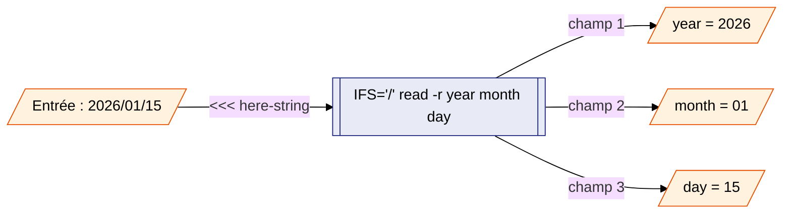
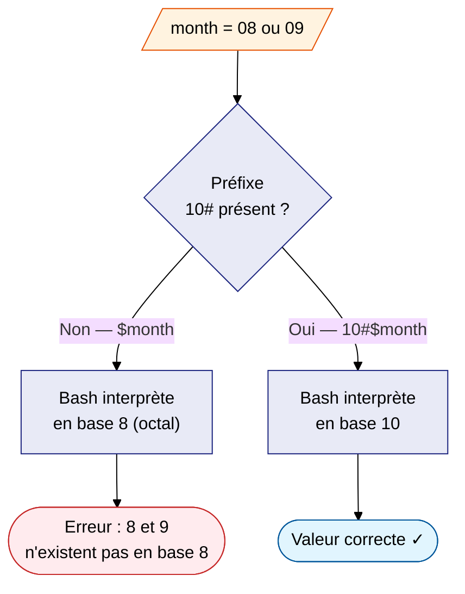
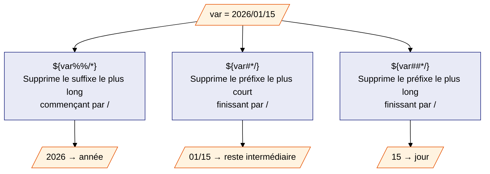
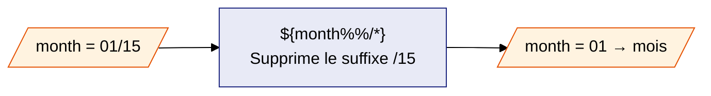

# Guide — `export_csv.sh`

> **Rôle :** lire le fichier JSON produit par `build_json.py` et extraire
> des données vers un fichier CSV (délimiteur `;`).

---

## Sommaire

1. [Rôle du script](#1-rôle-du-script)
2. [Prérequis](#2-prérequis)
3. [Utilisation](#3-utilisation)
4. [Les trois modes d'extraction](#4-les-trois-modes-dextraction)
5. [Filtre de date](#5-filtre-de-date)
6. [Variable d'environnement VLM_DATA_DIR](#6-variable-denvironnement-vlm_data_dir)
7. [Format des fichiers de sortie](#7-format-des-fichiers-de-sortie)
8. [jq — Guide pour débutants](#8-jq--guide-pour-débutants) — voir aussi [Guide jq](jq.md) et [Décryptage des filtres](filtres.md)
9. [Codes de sortie et dépannage](#9-codes-de-sortie-et-dépannage)

---

## 1. Rôle du script

`export_csv.sh` lit le fichier JSON produit par `build_json.py`.

Il extrait des données et les écrit dans un fichier CSV.

Le délimiteur CSV est le point-virgule (`;`).

Trois modes d'extraction sont disponibles :

| Mode | Option | Contenu |
|---|---|---|
| Global | `-g` | Une ligne par CSECT avec toutes ses métadonnées |
| Options | `-p` | Une ligne par module avec ses options de compilation |
| Compilateur | `-c` | Une ligne par module avec son compilateur |

---

## 2. Prérequis

Le script nécessite un seul outil externe :

| Outil | Rôle | Vérification |
|---|---|---|
| `jq` | Interroger le fichier JSON | `jq --version` |

**Installer jq sur Ubuntu / Debian :**

```bash
sudo apt update && sudo apt install -y jq
```

**Vérifier l'installation :**

```bash
jq --version
# → jq-1.7.1  (ou version supérieure)
```

---

## 3. Utilisation

### 3.1 Syntaxe

```bash
bash script/export_csv.sh -i FICHIER_JSON -o FICHIER_CSV MODE [OPTIONS]
```

### 3.2 Exemples en ligne de commande

```bash
# Mode global : toutes les métadonnées de chaque CSECT
bash script/export_csv.sh \
    -i datas/vlm.json -o datas/export_global.csv -g

# Mode options : les options de compilation par module
bash script/export_csv.sh \
    -i datas/vlm.json -o datas/export_options.csv -p

# Mode compilateur : le compilateur utilisé par module
bash script/export_csv.sh \
    -i datas/vlm.json -o datas/export_compilers.csv -c

# Avec filtre de date : modules liés à partir du 01/01/2025 uniquement
bash script/export_csv.sh \
    -i datas/vlm.json -o datas/export.csv -g -d 2025/01/01

# Afficher l'aide
bash script/export_csv.sh --help
```

### 3.3 Via le Makefile

Le Makefile expose une cible `query` qui appelle ce script avec des valeurs
par défaut modifiables :

```bash
make query
make query QUERY_MODE=-p QUERY_DATE=2026/01/01
```

Détail des variables (`QUERY_INPUT`, `QUERY_OUTPUT`, `QUERY_MODE`,
`QUERY_DATE`) et de toutes les autres commandes du projet (pipeline,
journal, nettoyage, documentation...) :

**→ [Le Makefile](../dev/makefile.md)**

### 3.4 Options disponibles

| Option | Forme longue | Valeur | Description |
|---|---|---|---|
| `-i` | `--input` | fichier | Fichier JSON d'entrée (défaut : `vlm.json`) |
| `-o` | `--output` | fichier | Fichier CSV de sortie (défaut : `query_output.csv`) |
| `-g` | `--global` | — | Mode global |
| `-p` | `--options` | — | Mode options de compilation |
| `-c` | `--compiler` | — | Mode compilateur |
| `-d` | `--date` | `yyyy/mm/dd` | Ne garder que les modules liés à partir de cette date |
| `-h` | `--help` | — | Afficher l'aide |

---

## 4. Les trois modes d'extraction

### 4.1 Mode global (`-g`)

Ce mode extrait **toutes les métadonnées** de chaque CSECT.

Une ligne est produite par CSECT.

**Colonnes de sortie :**

| N° | Nom | Exemple | Description |
|---|---|---|---|
| 1 | `loadlib` | `MY.LOAD.LIB` | PDS contenant des Load Modules |
| 2 | `load_name` | `MYPGM` | Module exécutable (Load Module) |
| 3 | `linkedon` | `2025/06/01` | Date de link-edit |
| 4 | `csect_name` | `MYPGM` | Nom de la section compilée |
| 5 | `compiler` | `Enterpr.COBOL for z/OS V6R3` | Compilateur utilisé |
| 6 | `ThreadSafe` | `ThreadSafe=false` | Module thread-safe ? |
| 7 | `CICS` | `CICS=false` | Utilise CICS ? |
| 8 | `DB2` | `DB2=false` | Utilise DB2 ? |
| 9 | `WMQ` | `WMQ=false` | Utilise WebSphere MQ ? |
| 10 | `identify` | `DY012345678` | Identifiant de package (vide si absent) |

**Exemple de sortie :**

```
MY.LOAD.LIB;MYPGM;2025/06/01;MYPGM;Enterpr.COBOL for z/OS V6R3;ThreadSafe=false;CICS=false;DB2=false;WMQ=false;DY012345678
```

---

### 4.2 Mode options (`-p`)

Ce mode extrait les **options de compilation** de chaque module.

Seul le **CSECT principal** est retenu.

!!! note "CSECT principal"
    Le CSECT principal est celui dont le nom est identique au nom du module.
    En IBM COBOL, c'est le programme lui-même.
    Les stubs DB2 (`DSNCLI`), CICS (`DFHECI`) et autres sont exclus.

Les options sont triées par ordre alphabétique.

Chaque option occupe sa propre colonne dans le CSV.

**Colonnes de sortie :**

| N° | Nom | Exemple | Description |
|---|---|---|---|
| 1 | `loadlib` | `MY.LOAD.LIB` | PDS contenant des Load Modules |
| 2 | `load_name` | `MYPGM` | Module exécutable (Load Module) |
| 3 | `linkedon` | `2025/06/01` | Date de link-edit |
| 4 | `compiler` | `Enterpr.COBOL for z/OS V6R3` | Compilateur |
| 5+ | options | `NOOPT;RENT;...` | Une option par colonne, triées alphabétiquement |

**Exemple de sortie :**

```
MY.LOAD.LIB;MYPGM;2025/06/01;Enterpr.COBOL for z/OS V6R3;NOOPT;RENT;RMODE(ANY)
```

---

### 4.3 Mode compilateur (`-c`)

Ce mode extrait le **compilateur utilisé** par chaque module.

Seul le **CSECT principal** est retenu (même règle que le mode options).

**Colonnes de sortie :**

| N° | Nom | Exemple | Description |
|---|---|---|---|
| 1 | `loadlib` | `MY.LOAD.LIB` | PDS contenant des Load Modules |
| 2 | `load_name` | `MYPGM` | Module exécutable (Load Module) |
| 3 | `linkedon` | `2025/06/01` | Date de link-edit |
| 4 | `csect_name` | `MYPGM` | Nom du CSECT principal |
| 5 | `compiler` | `Enterpr.COBOL for z/OS V6R3` | Compilateur utilisé |

**Exemple de sortie :**

```
MY.LOAD.LIB;MYPGM;2025/06/01;MYPGM;Enterpr.COBOL for z/OS V6R3
```

---

## 5. Filtre de date

### 5.1 Utilisation

L'option `-d yyyy/mm/dd` retient **uniquement** les modules dont la date de
link-edit (`Linkedon`) est **supérieure ou égale** à la date indiquée.

```bash
# Modules liés à partir du 1er janvier 2025
bash script/export_csv.sh \
    -i datas/vlm.json -o datas/export.csv -g -d 2025/01/01
```

**Format obligatoire :** `yyyy/mm/dd`

| Exemple | Valide ? | Raison |
|---|---|---|
| `2025/01/01` | ✓ | — |
| `2024/12/31` | ✓ | — |
| `01/01/2025` | ✗ | Jour et année inversés |
| `2025-01-01` | ✗ | Tirets non acceptés |
| `2025/1/1` | ✗ | Mois et jour sur 1 chiffre |

!!! info "Pourquoi la comparaison alphabétique fonctionne pour les dates ?"
    Les dates sont au format `aaaa/mm/jj`.
    L'année est en premier, puis le mois, puis le jour.
    Ce format permet un tri alphabétique équivalent au tri chronologique.
    Exemple : `"2025/06/01" > "2025/01/15"` est vrai dans les deux cas.

---

### 5.2 Comment le script découpe la date en interne

Une fois le format validé, le script sépare les trois composantes avec cette
commande :

```bash
IFS='/' read -r year month day <<< "2026/01/15"
```

Le diagramme suivant montre ce qui se passe étape par étape :



- `IFS='/'` — positionne le séparateur de champs sur `/`
- `read -r year month day` — assigne chaque champ à une variable
- `<<< "$2"` — *here-string* : transmet la valeur directement à `read` sans créer de fichier ni de sous-processus

---

### 5.3 Pourquoi `10#$month` et pas simplement `$month` ?

Bash interprète les nombres qui commencent par `0` comme de l'**octal** (base 8).
En base 8, les chiffres valides vont de `0` à `7`. Les valeurs `08` et `09`
seraient donc illégales sans précaution.



---

### 5.4 Référence — les opérateurs de découpe Bash

!!! note "Ce que le script utilisait avant"
    Le script découpait la date avec les opérateurs `%%`, `#`, `##` de Bash.
    Ces quatre lignes ont été **remplacées** par le `IFS='/' read -r` de la
    section 5.2, plus lisible et plus accessible.

    ```bash
    # Ancienne version — remplacée
    year="${2%%/*}"
    month="${2#*/}"
    month="${month%%/*}"
    day="${2##*/}"

    # Nouvelle version
    IFS='/' read -r year month day <<< "$2"
    ```

Ces opérateurs apparaissent souvent dans d'autres scripts shell. Les connaître
reste utile pour lire du code existant.

| Opérateur | Supprime | Depuis |
|---|---|---|
| `${var#motif}` | Le préfixe le **plus court** correspondant au motif | le début |
| `${var##motif}` | Le préfixe le **plus long** correspondant au motif | le début |
| `${var%motif}` | Le suffixe le **plus court** correspondant au motif | la fin |
| `${var%%motif}` | Le suffixe le **plus long** correspondant au motif | la fin |

Le `*` dans le motif signifie "n'importe quelle suite de caractères".

**Application à la date `2026/01/15`** — les trois extractions directes :



Pour isoler le mois, une deuxième opération est nécessaire sur le résultat `01/15` :



C'est précisément ce besoin d'une quatrième ligne pour un résultat intermédiaire
qui rend cette approche moins lisible que `IFS='/' read -r`.

---

## 6. Variable d'environnement `VLM_DATA_DIR`

Si la variable `VLM_DATA_DIR` est définie, les chemins relatifs sont
automatiquement préfixés par cette valeur.

```bash
# Définir le répertoire de base
export VLM_DATA_DIR=/home/user/vlm/datas

# Ces deux commandes sont alors équivalentes
bash script/export_csv.sh -i vlm.json -o output.csv -g
bash script/export_csv.sh \
    -i /home/user/vlm/datas/vlm.json \
    -o /home/user/vlm/datas/output.csv -g
```

Les chemins absolus (commençant par `/`) ne sont pas modifiés.

---

## 7. Format des fichiers de sortie

- **Encodage :** UTF-8
- **Délimiteur :** `;` (point-virgule)
- **Sans en-tête :** la première ligne contient déjà des données

**Ouvrir dans LibreOffice Calc :**

1. Menu Fichier → Ouvrir → sélectionner le fichier `.csv`
2. Choisir `;` comme séparateur de colonnes
3. Choisir l'encodage `UTF-8`

**Ouvrir dans Microsoft Excel :**

1. Onglet Données → Depuis un fichier texte/CSV
2. Choisir `;` comme délimiteur
3. Choisir l'encodage `65001 : Unicode (UTF-8)`

---

## 8. `jq` — Guide pour débutants

`export_csv.sh` utilise `jq` pour interroger le fichier JSON.
Deux pages dédiées détaillent son fonctionnement :

**→ [Guide jq](jq.md)** — couvre depuis zéro : JSON, les filtres, `.[]`,
`|`, `select`, `as $var`, `//`, `sort`, `join`, `length`, `--arg`.

**→ [Décryptage des filtres](filtres.md)** — applique ces concepts aux
filtres réels des trois modes (`-g`, `-p`, `-c`).

---

## 9. Codes de sortie et dépannage

### 9.1 Codes de sortie

| Code | Signification |
|---|---|
| `0` | Succès — le fichier CSV a été produit |
| `1` | Erreur — argument invalide, prérequis manquant ou fichier introuvable |

### 9.2 Messages d'erreur courants

**`Error: input file 'vlm.json' not found.`**

```bash
ls -la datas/vlm.json   # vérifier que le fichier existe
```

---

**`Error: jq is not installed (or not in PATH).`**

```bash
sudo apt install -y jq
jq --version
```

---

**`Error: date format must be yyyy/mm/dd`**

```bash
# Correct
bash script/export_csv.sh ... -d 2025/06/01

# Incorrect
bash script/export_csv.sh ... -d 01/06/2025   # ordre inversé
bash script/export_csv.sh ... -d 2025-06-01   # tirets non acceptés
```

---

**`Error: unknown option '-x'`**

```bash
bash script/export_csv.sh --help
```

---

**Le fichier CSV est vide**

Si aucune ligne ne correspond aux critères, le fichier est créé mais vide.
Avec un filtre de date `-d`, vérifiez que la date n'est pas trop récente :

```bash
# Voir toutes les dates présentes dans le JSON
jq -r '.[].Loadmods[].Linkedon' datas/vlm.json | sort -u
```
