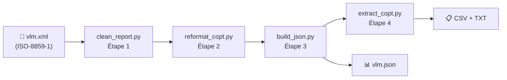

# VLM Pipeline — Documentation

**VLM** (*View Load Module*) est une fonction d'IBM File Manager qui analyse
les load modules d'une loadlib z/OS. Le rapport produit (`vlm.xml`) est la
matière première de ce pipeline.

---

## Vue d'ensemble

Le pipeline transforme un rapport IBM File Manager VLM en données structurées
interrogeables via CSV, en quatre étapes enchaînées :



!!! note "Orchestration"
    `pipeline.py` exécute les quatre étapes en séquence via `subprocess`.
    Tout code de sortie non nul arrête immédiatement le pipeline.

## Scripts du pipeline

| Étape | Script | Rôle |
| ----- | ------ | ---- |
| —  | [`pipeline.py`](pipeline/business_rules.md) | Orchestrateur — exécute les 4 étapes en séquence. |
| 1  | [`clean_report.py`](clean_report/business_rules.md) | Nettoyage du rapport VLM brut (suppression ASA, injection d'attributs XML). |
| 2  | [`reformat_copt.py`](reformat_copt/business_rules.md) | Normalisation des balises COPT (tokeniseur *paren-depth-aware*). |
| 3  | [`build_json.py`](build_json/business_rules.md) | Conversion XML → JSON structuré (Loadlib → Loadmod → CSECT). |
| 4  | [`extract_copt.py`](extract_copt/business_rules.md) | Extraction des options COPT par CSECT vers CSV et fichiers `.txt`. |
| —  | [`inspect_copt.py`](inspect_copt/business_rules.md) | Utilitaire de diagnostic — affiche les balises `<Copt>` d'un fichier XML. |
| —  | [`export_csv.sh`](export_csv/guide.md) | Script Bash alternatif — interroge `vlm.json` via `jq` (3 modes d'export). |

## Arborescence du projet

Vue d'ensemble des principaux fichiers et répertoires du dépôt — pour le
détail de chaque script, voir le tableau ci-dessus.

### Code et scripts

| Chemin | Rôle |
|---|---|
| `src/` | Code Python du pipeline (4 étapes + utilitaires partagés) |
| `script/export_csv.sh` | Export CSV alternatif via `jq` — [Guide](export_csv/guide.md) |
| `script/serve_docs.sh` | Lance MkDocs en local |
| `tests/` | Tests pytest — voir [Tests](dev/tests.md) |

### Données (non versionné)

| Chemin | Rôle |
|---|---|
| `datas/vlm.xml` | Rapport VLM brut — entrée du pipeline, jamais supprimé par `make clean` |
| `datas/clean_vlm.xml`, `datas/clean_vlm_copt.xml` | Fichiers intermédiaires (étapes 1 et 2) |
| `datas/vlm.json` | Sortie principale du pipeline (étape 3) |
| `datas/copt/` | CSV + fichiers COPT par CSECT (étape 4) |
| `datas/pipeline.log` | Journal du pipeline — `make log` |

### Configuration

| Chemin | Rôle |
|---|---|
| `config.toml` | Chemins et configuration du logging, lus par `src/utils.py` |
| `pyproject.toml` | Dépendances et configuration des outils (pytest, mypy, coverage) |
| `ruff.toml` | Configuration du linter/formatter `ruff` |
| `pyrightconfig.json` | Configuration Pyright (vérification de types dans l'IDE) |
| `.env.example`, `.envrc` | Variables d'environnement (`direnv`) — voir [Installation](dev/installation.md) |
| `.pre-commit-config.yaml` | Hooks pre-commit (lint, gitlint, ...) |
| `requirements.txt` | Export figé des dépendances (généré, voir l'en-tête du fichier) |

### Pilotage et conteneurisation

| Chemin | Rôle |
|---|---|
| `Makefile` | Toutes les commandes du projet — voir [Le Makefile](dev/makefile.md) |
| `Dockerfile`, `.dockerignore` | Image de conteneur — voir [Conteneurisation](docker/index.md) |

### Documentation et divers

| Chemin | Rôle |
|---|---|
| `doc/`, `mkdocs.yml` | Sources et configuration de cette documentation |
| `README.md` | Aperçu rapide du projet |
| `AGENTS.md` | Contexte projet partagé entre tous les assistants IA |
| `CHANGELOG.md` | Historique des versions (Keep a Changelog) |
| `.vscode/` | Configuration de l'éditeur (tâches, débogage) |

## Commandes rapides

```bash
# Installer l'environnement
uv sync

# Lancer le pipeline complet
uv run python src/pipeline.py

# Lancer une ou plusieurs étapes
uv run python src/pipeline.py 3        # étape 3 uniquement
uv run python src/pipeline.py 2-4     # étapes 2 à 4
uv run python src/pipeline.py extract # étape 4 par alias

# Exporter en CSV
bash script/export_csv.sh -i datas/vlm.json -o datas/output.csv -g

# Générer cette documentation (mode prévisualisation)
bash script/serve_docs.sh
# ou : uv run mkdocs serve

# Générer cette documentation (HTML statique)
uv run mkdocs build
```

## Développement

Voir l'onglet **Développement** pour l'installation pas à pas,
les commandes de test, de lint et de vérification des types, ainsi que
[toutes les commandes `make` du projet](dev/makefile.md).

## Environnement technique

- **Mainframe** : IBM z/OS 2.5
- **Compilateur** : IBM Enterprise COBOL 6.3
- **Python** : 3.12+, gestionnaire de paquets `uv`
- **Format de sortie** : JSON + CSV (délimiteur `;`, encodage UTF-8)
