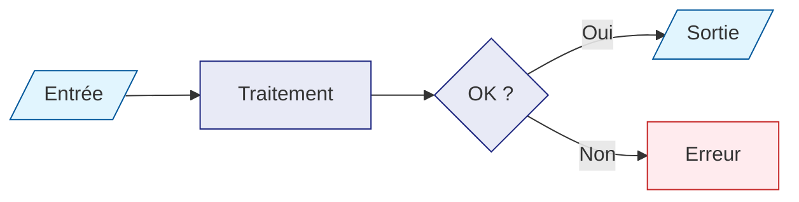

# Guide MkDocs — Documentation statique depuis Markdown

> **MkDocs** transforme vos fichiers texte (Markdown) en un site web HTML
> complet, navigable et consultable. Aucune connaissance en HTML ou CSS n'est
> requise. Ce guide couvre l'installation sur Ubuntu 24.04, la configuration
> et l'utilisation depuis un script Bash.

---

## Sommaire

1. [Qu'est-ce que MkDocs ?](#1-quest-ce-que-mkdocs-)
2. [Prérequis système](#2-prérequis-système)
3. [Installation sur Ubuntu 24.04](#3-installation-sur-ubuntu-2404)
4. [Ajouter MkDocs à un projet Python](#4-ajouter-mkdocs-à-un-projet-python)
5. [Structure d'un projet MkDocs](#5-structure-dun-projet-mkdocs)
6. [Configuration : `mkdocs.yml`](#6-configuration--mkdocsyml)
7. [Écrire du contenu en Markdown](#7-écrire-du-contenu-en-markdown)
8. [Exemple concret : ce projet VLM](#8-exemple-concret--ce-projet-vlm)
9. [Commandes quotidiennes](#9-commandes-quotidiennes)
10. [Mise en œuvre depuis un script Bash](#10-mise-en-œuvre-depuis-un-script-bash)
11. [Dépannage](#11-dépannage)

---

## 1. Qu'est-ce que MkDocs ?

### 1.1 Le problème résolu

Écrire de la documentation directement en HTML est fastidieux : balises
verbeux, mise en forme répétitive, fichiers difficiles à lire et à maintenir.
MkDocs résout ce problème en vous laissant écrire en **Markdown** — un format
texte simple et lisible — et en générant automatiquement un site HTML propre.

```
Vous écrivez ça :         MkDocs génère ça :

## Mon titre              <h2>Mon titre</h2>
                          <p>Un paragraphe ordinaire
Un paragraphe             en HTML bien formé.</p>
ordinaire.
                          <pre><code>print("hello")
    print("hello")        </code></pre>
```

### 1.2 Positionnement parmi les outils similaires

| Outil | Langage | Public cible | Points forts |
|---|---|---|---|
| **MkDocs** | Python | Développeurs | Simple, rapide, thème Material |
| Sphinx | Python | Développeurs Python | Référence absolue pour les APIs |
| Jekyll | Ruby | Blogueurs, GitHub Pages | Intégré à GitHub Pages |
| Hugo | Go | Toute doc large | Très rapide, polyvalent |
| Docusaurus | Node.js | Docs de produit | Riche en fonctionnalités React |

**MkDocs est le meilleur choix** quand vous voulez quelque chose qui marche
en 10 minutes, que votre équipe utilise Python et que vous voulez un thème
professionnel sans configuration excessive.

### 1.3 Architecture de haut niveau

```
Fichiers sources         Outil              Site HTML généré
─────────────────        ──────             ─────────────────
doc/
  index.md          ──►                ──► site/
  guide.md               MkDocs             index.html
  api/                   (Python)           guide/
    reference.md    ──►                ──►    index.html
mkdocs.yml ─────────────►                    api/
(configuration)                              reference/
                                               index.html
                                           search/
                                             search_index.json
                                           assets/ (CSS, JS)
```

Le répertoire `site/` généré est un site **entièrement statique** : aucun
serveur applicatif n'est nécessaire pour l'héberger. Il peut être déposé sur
un serveur web simple (Apache, Nginx), sur GitHub Pages, ou consulté
directement depuis le disque.

---

## 2. Prérequis système

### 2.1 Ce dont vous avez besoin

| Composant | Version minimale | Rôle |
|---|---|---|
| Ubuntu | 24.04 LTS (Noble) | Système d'exploitation |
| Python | 3.11+ | Nécessaire pour exécuter MkDocs |
| uv | Dernière version | Gestionnaire de paquets Python |
| Git | 2.x | Versionner votre documentation |

!!! note "Python sur Ubuntu 24.04"
    Ubuntu 24.04 livre Python **3.12** par défaut, ce qui est suffisant pour
    MkDocs. Si votre projet impose Python 3.13 ou 3.14, `uv` peut installer
    et gérer ces versions pour vous (voir §3.3).

### 2.2 Vérifier votre environnement actuel

Ouvrez un terminal et tapez ces commandes une par une :

```bash
# Vérifier la version d'Ubuntu
lsb_release -d
# → Description: Ubuntu 24.04.x LTS

# Vérifier Python
python3 --version
# → Python 3.12.x  (ou supérieur)

# Vérifier Git
git --version
# → git version 2.x.x
```

---

## 3. Installation sur Ubuntu 24.04

### 3.1 Dépendances système

Ces paquets sont nécessaires avant d'installer quoi que ce soit avec Python.
Certains sont déjà présents sur Ubuntu 24.04 ; la commande est idempotente
(sans effet si le paquet est déjà installé) :

```bash
sudo apt update && sudo apt install -y \
    python3 \
    python3-venv \
    curl \
    git
```

| Paquet | Rôle |
|---|---|
| `python3` | Interpréteur Python (MkDocs est écrit en Python) |
| `python3-venv` | Crée des environnements Python isolés |
| `curl` | Télécharge l'installateur de `uv` |
| `git` | Versionner le code source et la documentation |

!!! warning "Ne pas utiliser `apt install python3-mkdocs`"
    Ubuntu 24.04 propose un paquet `python3-mkdocs` dans ses dépôts officiels,
    mais il installe une version ancienne et partagée entre tous les projets.
    **Préférez toujours une installation par projet avec `uv`** : chaque
    projet garde sa propre version de MkDocs, sans conflit.

### 3.2 Installer `uv`

`uv` est un gestionnaire de paquets Python ultra-rapide écrit en Rust.
Il remplace `pip`, `virtualenv` et `pip-tools` en un seul outil.

```bash
# Télécharger et exécuter l'installateur officiel
curl -LsSf https://astral.sh/uv/install.sh | sh

# Recharger le PATH pour que la commande uv soit disponible
source "$HOME/.local/bin/env"

# Vérifier l'installation
uv --version
# → uv 0.x.x (...)
```

!!! tip "Rendre `uv` disponible dans tous les terminaux"
    L'installateur ajoute automatiquement `uv` à votre `~/.bashrc` ou
    `~/.zshrc`. Si la commande `uv` n'est pas trouvée dans un nouveau
    terminal, vérifiez que `~/.local/bin` est dans votre `PATH` :

    ```bash
    echo 'export PATH="$HOME/.local/bin:$PATH"' >> ~/.bashrc
    source ~/.bashrc
    ```

### 3.3 Installer Python 3.14 (optionnel, si votre projet l'exige)

Si votre projet requiert une version de Python plus récente que celle fournie
par Ubuntu, `uv` peut la télécharger et la gérer pour vous :

```bash
# Installer Python 3.14
uv python install 3.14

# Vérifier les versions disponibles
uv python list
```

Cela télécharge un binaire Python autonome dans `~/.local/share/uv/python/`.
Aucun impact sur le Python système d'Ubuntu.

---

## 4. Ajouter MkDocs à un projet Python

### 4.1 Initialiser un projet avec `uv` (si nécessaire)

Si vous partez de zéro, créez d'abord un projet :

```bash
mkdir mon-projet && cd mon-projet
uv init
```

`uv init` crée la structure minimale :

```
mon-projet/
├── pyproject.toml   ← métadonnées et dépendances du projet
├── README.md
└── hello.py
```

### 4.2 Ajouter MkDocs et le thème Material

```bash
# Ajouter MkDocs et le thème Material dans les dépendances de développement
uv add --dev mkdocs mkdocs-material
```

Votre `pyproject.toml` contiendra maintenant :

```toml
[dependency-groups]
dev = [
    "mkdocs>=1.6.1",
    "mkdocs-material>=9.7.6",
]
```

!!! info "Pourquoi `--dev` ?"
    MkDocs sert à générer de la documentation ; il ne fait pas partie du
    code applicatif livré. Le placer dans les dépendances `dev` évite qu'il
    soit installé dans les environnements de production.

### 4.3 Installer les dépendances

```bash
uv sync
```

Cette commande lit `pyproject.toml`, crée un environnement virtuel dans
`.venv/` et installe tous les paquets (y compris MkDocs). À répéter après
chaque ajout de dépendance.

### 4.4 Vérifier l'installation

```bash
uv run mkdocs --version
# → INFO    -  MkDocs version : 1.6.x, Python version: 3.x.x, Platform: linux
```

!!! note "Toujours préfixer avec `uv run`"
    `uv run mkdocs` garantit que c'est le MkDocs installé dans **ce projet**
    qui est utilisé, pas un autre potentiellement présent sur le système.

---

## 5. Structure d'un projet MkDocs

### 5.1 Arborescence minimale

```
mon-projet/
├── mkdocs.yml          ← configuration MkDocs (obligatoire)
├── pyproject.toml      ← dépendances Python
├── docs/               ← dossier source par défaut (configurable)
│   ├── index.md        ← page d'accueil (obligatoire)
│   ├── guide.md
│   └── api/
│       └── reference.md
└── site/               ← généré par "mkdocs build" (ne pas versionner)
```

### 5.2 Règles importantes

- Le fichier `mkdocs.yml` doit se trouver à la **racine du projet**.
- La page `index.md` (ou `README.md`) est **obligatoire** dans le dossier
  source — c'est la page d'accueil du site.
- Le répertoire `site/` est généré automatiquement. Ajoutez-le à
  votre `.gitignore` pour ne pas le versionner :

```bash
echo "site/" >> .gitignore
```

### 5.3 Dossier source personnalisable

Par défaut, MkDocs cherche les fichiers Markdown dans `docs/`. Vous pouvez
changer ce dossier via la clé `docs_dir` dans `mkdocs.yml` :

```yaml
docs_dir: doc   # ← utilise "doc/" au lieu de "docs/"
```

---

## 6. Configuration : `mkdocs.yml`

Le fichier `mkdocs.yml` est le cœur de la configuration. Il est au format
**YAML** : un format texte basé sur l'indentation (comme Python).

### 6.1 Configuration minimale

```yaml
site_name: Mon Projet
docs_dir: docs
```

Deux lignes suffisent pour avoir un site fonctionnel. Toutes les autres
options sont optionnelles.

### 6.2 Configuration complète annotée

```yaml
# ─── Métadonnées du site ────────────────────────────────────────────────────
site_name: Mon Projet — Documentation        # (1)
site_description: >                          # (2)
  Description courte du projet,
  sur plusieurs lignes si besoin.
site_author: Prénom NOM                      # (3)

# ─── Répertoires ─────────────────────────────────────────────────────────────
docs_dir: doc                                # (4)
# site_dir: site                             # (5) valeur par défaut

# ─── Thème ───────────────────────────────────────────────────────────────────
theme:
  name: material                             # (6)
  language: fr                               # (7)
  palette:                                   # (8)
    - media: "(prefers-color-scheme: light)"
      scheme: default
      primary: indigo
      accent: indigo
      toggle:
        icon: material/weather-night
        name: Passer en mode sombre
    - media: "(prefers-color-scheme: dark)"
      scheme: slate
      primary: indigo
      accent: indigo
      toggle:
        icon: material/weather-sunny
        name: Passer en mode clair
  features:                                  # (9)
    - navigation.tabs          # onglets de navigation en haut
    - navigation.tabs.sticky   # onglets visibles même en défilant
    - navigation.sections      # sections dans la barre latérale
    - navigation.top           # bouton "retour en haut"
    - search.highlight         # surligne les termes dans les résultats
    - search.suggest           # suggestions lors de la recherche
    - content.code.copy        # bouton "copier" sur les blocs de code
    - content.code.annotate    # numéros d'annotation dans le code

# ─── Extensions Markdown ─────────────────────────────────────────────────────
markdown_extensions:
  - admonition                 # (10) boîtes note/warning/tip
  - tables                     # (11) tableaux Markdown standard
  - attr_list                  # (12) attributs HTML sur les éléments
  - def_list                   # (13) listes de définitions
  - footnotes                  # (14) notes de bas de page
  - toc:                       # (15) table des matières automatique
      permalink: true
      title: Sur cette page
  - pymdownx.highlight:        # (16) coloration syntaxique du code
      anchor_linenums: true
      line_spans: __span
      pygments_lang_class: true
  - pymdownx.inlinehilite      # (17) code inline coloré `#!python print()`
  - pymdownx.superfences:      # (18) blocs de code imbriqués + Mermaid
      custom_fences:
        - name: mermaid
          class: mermaid
          format: !!python/name:pymdownx.superfences.fence_code_format
  - pymdownx.tabbed:           # (19) onglets dans le contenu
      alternate_style: true
  - pymdownx.details           # (20) sections repliables (??? / ???+)
  - pymdownx.snippets          # (21) inclure un fichier dans un autre

# ─── Options diverses ─────────────────────────────────────────────────────────
extra:
  generator: false             # (22) masque "Made with MkDocs" dans le pied

# ─── Navigation ──────────────────────────────────────────────────────────────
nav:                           # (23)
  - Accueil: index.md
  - Guide: guide.md
  - API:
      - Référence: api/reference.md
```

Explication de chaque annotation :

| N° | Clé | Effet |
|---|---|---|
| (1) | `site_name` | Titre affiché dans l'onglet du navigateur et l'en-tête |
| (2) | `site_description` | Métadonnée HTML `<meta description>` pour le SEO |
| (3) | `site_author` | Métadonnée HTML `<meta author>` |
| (4) | `docs_dir` | Répertoire contenant les fichiers `.md` sources |
| (5) | `site_dir` | Répertoire de sortie HTML (défaut : `site/`) |
| (6) | `theme.name` | Thème visuel ; `material` = Material for MkDocs |
| (7) | `theme.language` | Langue de l'interface (boutons, labels de recherche…) |
| (8) | `theme.palette` | Couleurs et mode clair/sombre automatique selon l'OS |
| (9) | `theme.features` | Fonctionnalités de navigation activées |
| (10) | `admonition` | Boîtes colorées `!!! note`, `!!! warning`, `!!! tip` |
| (11) | `tables` | Tableaux `| col1 | col2 |` en Markdown standard |
| (12) | `attr_list` | Ajouter des classes CSS `{ .ma-classe }` |
| (13) | `def_list` | Listes de termes `: définition` |
| (14) | `footnotes` | Renvois `[^1]` et `[^1]: texte` |
| (15) | `toc` | Table des matières générée depuis les titres `##` |
| (16) | `pymdownx.highlight` | Coloration syntaxique avec Pygments |
| (17) | `pymdownx.inlinehilite` | Couleur sur `#!python code` dans une phrase |
| (18) | `pymdownx.superfences` | Diagrammes Mermaid dans des blocs de code |
| (19) | `pymdownx.tabbed` | Contenu en onglets `=== "Onglet 1"` |
| (20) | `pymdownx.details` | Sections `??? "Titre"` repliables au clic |
| (21) | `pymdownx.snippets` | `--8<-- "fichier.txt"` inclut un autre fichier |
| (22) | `extra.generator` | `false` = pas de mention MkDocs dans le pied de page |
| (23) | `nav` | Plan de navigation explicite du site |

### 6.3 Navigation : avec ou sans `nav` ?

**Sans `nav`** dans `mkdocs.yml` : MkDocs découvre automatiquement tous
les fichiers `.md` du dossier source et les liste par ordre alphabétique.
Pratique pour démarrer vite.

**Avec `nav`** : vous contrôlez précisément l'ordre, les titres et la
structure. Recommandé dès que le site dépasse 3 ou 4 pages.

```yaml
# Exemple de nav avec sous-sections
nav:
  - Accueil: index.md
  - Guide utilisateur:
      - Installation: install.md
      - Configuration: config.md
      - Premier projet: quickstart.md
  - Référence technique:
      - API: api/reference.md
      - Options: api/options.md
  - Contribuer: contributing.md
```

---

## 7. Écrire du contenu en Markdown

### 7.1 Syntaxe de base

```markdown
# Titre de niveau 1 (une seule fois par page)
## Titre de niveau 2 (apparaît dans la table des matières)
### Titre de niveau 3

Paragraphe normal. Deux espaces en fin de ligne  
forcent un retour à la ligne.

**gras**, *italique*, `code inline`, ~~barré~~

- liste à puces
- deuxième élément
  - sous-élément (indentation 2 espaces)

1. liste numérotée
2. deuxième point

[texte du lien](https://exemple.com)
[lien interne](autre-page.md)


```

### 7.2 Blocs de code avec coloration syntaxique

````markdown
```python
def bonjour(nom: str) -> str:
    return f"Bonjour, {nom} !"
```

```bash
#!/usr/bin/env bash
set -euo pipefail
echo "Hello, world!"
```

```toml
[settings]
clé = "valeur"
```
````

### 7.3 Tableaux

```markdown
| Colonne 1 | Colonne 2 | Colonne 3 |
|---|---|---|
| A | B | C |
| D | E | F |

# Alignement
| Gauche | Centre | Droite |
|:-------|:------:|-------:|
| x      |   y    |      z |
```

### 7.4 Admonitions (boîtes colorées)

Les admonitions sont des boîtes mises en valeur.

Elles nécessitent l'extension `admonition` dans `mkdocs.yml`.

**Syntaxe de base :**

```markdown
!!! note "Titre de la note"
    Contenu de la note.
    L'indentation de 4 espaces est obligatoire.
    Le titre entre guillemets est optionnel.
```

**Règles de syntaxe :**

- `!!!` suivi du type (`note`, `warning`, etc.)
- Le titre entre `"..."` est optionnel. Sans titre, le type s'affiche automatiquement.
- Le contenu est indenté de **4 espaces**. Cette indentation est obligatoire.

**Types disponibles :**

| Type | Couleur | Usage |
|---|---|---|
| `note` | Bleu | Information complémentaire |
| `info` | Bleu clair | Précision utile |
| `tip` | Vert | Conseil, bonne pratique |
| `success` | Vert | Résultat attendu, validation |
| `warning` | Orange | Avertissement |
| `danger` | Rouge | Action irréversible, risque |
| `bug` | Rouge | Problème connu |
| `example` | Violet | Exemple concret |
| `quote` | Gris | Citation |

```markdown
!!! tip "Conseil"
    Préférez `uv run mkdocs serve` à `mkdocs serve`.
    Cela garantit l'utilisation de la bonne version.

!!! warning "Attention"
    Ne versionnez pas le répertoire `site/`.
    Ajoutez-le à votre `.gitignore`.

!!! danger "Irréversible"
    `git reset --hard` supprime toutes les modifications non commitées.
```

---

### 7.4b Volets repliables (details)

Un volet repliable se comporte comme une admonition, mais l'utilisateur
peut l'ouvrir ou le fermer en cliquant dessus.

Cela nécessite l'extension `pymdownx.details` dans `mkdocs.yml`.

**Différence avec `!!!` :**

| Syntaxe | Comportement |
|---|---|
| `!!! note` | Toujours visible, non repliable |
| `??? note` | Replié par défaut, s'ouvre au clic |
| `???+ note` | Ouvert par défaut, peut être replié |

**Exemple — replié par défaut (`???`) :**

```markdown
??? "Afficher le détail technique"
    Cette section est cachée au chargement de la page.
    L'utilisateur doit cliquer pour la lire.

    On peut mettre n'importe quel contenu à l'intérieur :
    du texte, des listes, des blocs de code.
```

**Exemple — ouvert par défaut (`???+`) :**

```markdown
???+ tip "Astuce avancée"
    Cette section est visible au chargement, mais peut être refermée.
    Utile pour du contenu important que l'on veut quand même pouvoir masquer.
```

**Quand utiliser les volets repliables ?**

- Cacher des explications longues ou des détails techniques secondaires.
- Proposer des exemples complets sans alourdir la page.
- Masquer des réponses dans un guide de type FAQ.

```markdown
??? example "Exemple complet de filtre jq"
    ```bash
    jq -r '
        .[]
        | .Loadlib as $lib
        | .Loadmods[] as $lm
        | "\($lib);\($lm.Name)"
    ' datas/vlm.json
    ```

??? warning "Pourquoi ne pas utiliser `pip` ?"
    `pip` installe les paquets dans l'environnement Python global.
    Cela peut créer des conflits entre projets.
    Utilisez toujours `uv` pour isoler les dépendances par projet.
```

---

### 7.5 Onglets dans le contenu

Les onglets permettent de présenter plusieurs variantes d'un même contenu.

L'utilisateur clique sur un onglet pour afficher la variante correspondante.

Cela nécessite l'extension `pymdownx.tabbed` avec `alternate_style: true` dans `mkdocs.yml`.

**Syntaxe :**

```markdown
=== "Nom de l'onglet 1"

    Contenu de l'onglet 1.
    Indenté de 4 espaces.

=== "Nom de l'onglet 2"

    Contenu de l'onglet 2.
```

**Règles de syntaxe :**

- `===` suivi du nom de l'onglet entre `"..."`.
- Une **ligne vide** est obligatoire entre `=== "..."` et le contenu.
- Le contenu est indenté de **4 espaces**.
- Les onglets doivent se suivre sans ligne vide entre eux.

**Exemple — commandes par système d'exploitation :**

```markdown
=== "Ubuntu / Debian"

    ```bash
    sudo apt install jq
    ```

=== "Arch Linux"

    ```bash
    sudo pacman -S jq
    ```

=== "macOS"

    ```bash
    brew install jq
    ```
```

**Exemple — plusieurs types de contenu dans un onglet :**

```markdown
=== "Python"

    Installer avec `uv` :

    ```bash
    uv add requests
    ```

    Importer dans le code :

    ```python
    import requests
    response = requests.get("https://exemple.com")
    ```

=== "Bash"

    Installer `curl` :

    ```bash
    sudo apt install curl
    ```

    Faire une requête :

    ```bash
    curl https://exemple.com
    ```
```

**Quand utiliser les onglets ?**

- Présenter la même procédure sur plusieurs systèmes (Linux, macOS, Windows).
- Montrer le même exemple dans plusieurs langages.
- Proposer une version simple et une version avancée d'une configuration.

### 7.6 Diagrammes Mermaid

MkDocs Material intègre le support natif des diagrammes Mermaid via
l'extension `pymdownx.superfences` (configurée dans `mkdocs.yml`).

````markdown

````

---

## 8. Exemple concret : ce projet VLM

Voici comment ce projet utilise MkDocs pour documenter un pipeline ETL
de traitement de rapports IBM mainframe.

### 8.1 Structure des fichiers source

```
vlm/
├── mkdocs.yml                       ← configuration MkDocs
├── pyproject.toml                   ← MkDocs dans [dependency-groups] dev
└── doc/                             ← docs_dir configuré à "doc"
    ├── index.md                     ← page d'accueil + vue d'ensemble
    ├── pipeline/
    │   └── business_rules.md        ← orchestrateur pipeline.py
    ├── clean_report/
    │   └── business_rules.md        ← étape 1
    ├── reformat_copt/
    │   └── business_rules.md        ← étape 2
    ├── build_json/
    │   └── business_rules.md        ← étape 3
    ├── extract_copt/
    │   └── business_rules.md        ← étape 4
    └── mkdocs/
        └── guide.md                 ← ce fichier
```

### 8.2 `pyproject.toml` : dépendances MkDocs

```toml
[project]
name = "vlm"
version = "0.1.0"
requires-python = ">=3.14"
dependencies = []              # ← aucune dép. applicative

[dependency-groups]
dev = [
    "mkdocs>=1.6.1",           # ← outil de génération
    "mkdocs-material>=9.7.6",  # ← thème visuel
]
```

!!! tip "Séparer les dépendances applicatives des outils de développement"
    Les dépendances dans `[dependency-groups] dev` (comme MkDocs) ne sont
    pas installées dans un environnement de production. Seules les dépendances
    de `[project] dependencies` le sont.

### 8.3 `mkdocs.yml` : navigation en onglets

```yaml
site_name: VLM Pipeline — Documentation
site_description: >
  Pipeline ETL de transformation des rapports IBM File Manager (VLM)
  en données JSON et CSV interrogeables.
site_author: Alan MARCHAND
docs_dir: doc                  # ← dossier source personnalisé

theme:
  name: material
  language: fr
  features:
    - navigation.tabs          # ← chaque entrée de nav devient un onglet
    - navigation.tabs.sticky
    - content.code.copy        # ← bouton copier sur tous les blocs de code

nav:
  - Accueil: index.md
  - Orchestrateur — pipeline.py: pipeline/business_rules.md
  - "1 · Nettoyage — clean_report.py": clean_report/business_rules.md
  - "2 · Reformatage COPT — reformat_copt.py": reformat_copt/business_rules.md
  - "3 · Conversion JSON — build_json.py": build_json/business_rules.md
  - "4 · Extraction CSV — extract_copt.py": extract_copt/business_rules.md
  - "Outils — MkDocs": mkdocs/guide.md
```

---

## 9. Commandes quotidiennes

### 9.1 Tableau récapitulatif

| Commande | Effet | Quand l'utiliser |
|---|---|---|
| `uv sync` | Installe / met à jour les dépendances | Après `git pull` ou ajout de paquet |
| `uv run mkdocs serve` | Serveur local avec rechargement automatique | Pendant l'écriture |
| `uv run mkdocs build` | Génère `site/` en HTML statique | Avant déploiement |
| `uv run mkdocs build --strict` | Idem + erreur si lien brisé | En CI/CD |
| `uv run mkdocs --help` | Aide complète | En cas de doute |

### 9.2 Serveur local de développement

```bash
uv run mkdocs serve
```

Ouvrez votre navigateur à l'adresse affichée (par défaut
`http://127.0.0.1:8000`). Chaque sauvegarde d'un fichier `.md` ou de
`mkdocs.yml` **recharge automatiquement** la page dans le navigateur.

```
INFO    -  Building documentation...
INFO    -  Cleaning site directory
INFO    -  Documentation built in 0.42 seconds
INFO    -  [HH:MM:SS] Watching paths for changes: 'doc', 'mkdocs.yml'
INFO    -  [HH:MM:SS] Serving on http://127.0.0.1:8000/
```

Arrêtez le serveur avec `Ctrl+C`.

### 9.3 Générer le HTML statique

```bash
uv run mkdocs build
```

Le répertoire `site/` contient le site complet. Vous pouvez l'ouvrir
directement dans un navigateur ou le déployer sur n'importe quel hébergement
de fichiers statiques.

```bash
# Ouvrir le site généré localement
xdg-open site/index.html
```

### 9.4 Mode strict (recommandé en CI)

```bash
uv run mkdocs build --strict
```

En mode strict, MkDocs retourne le code d'erreur `1` si la documentation
contient des **liens brisés** (vers des pages ou des ancres inexistantes).
C'est la commande à utiliser dans un pipeline CI/CD pour garantir la qualité.

---

## 10. Mise en œuvre depuis un script Bash

### 10.1 Cas d'usage typiques

Un script Bash pour MkDocs est utile pour :

- **Automatiser** la génération avant un déploiement.
- **Centraliser** les paramètres (répertoire de destination, URL de base…).
- **Intégrer** la génération de documentation dans un pipeline CI/CD.
- **Contrôler** que les prérequis sont respectés avant de lancer la
  génération.

### 10.2 Script de génération et déploiement local

```bash
#!/usr/bin/env bash
# =============================================================================
# build_docs.sh — Génère la documentation HTML du projet avec MkDocs.
#
# Usage :
#   bash build_docs.sh [--serve] [--strict] [--output DIR]
#
# Options :
#   --serve        Lance le serveur de développement (port 8000).
#   --strict       Traite les liens brisés comme des erreurs.
#   --output DIR   Répertoire de sortie (défaut : site/).
#
# Codes de sortie :
#   0  Succès
#   1  Prérequis manquant
#   2  Erreur de génération MkDocs
# =============================================================================
set -euo pipefail

# ─── Couleurs ────────────────────────────────────────────────────────────────
RED='\033[0;31m'
GREEN='\033[0;32m'
YELLOW='\033[1;33m'
BLUE='\033[0;34m'
RESET='\033[0m'

# ─── Variables par défaut ────────────────────────────────────────────────────
SERVE=false
STRICT=false
OUTPUT_DIR="site"
SCRIPT_DIR="$(cd "$(dirname "${BASH_SOURCE[0]}")" && pwd)"
PROJECT_ROOT="$(cd "${SCRIPT_DIR}/.." && pwd)"

# ─── Fonctions utilitaires ───────────────────────────────────────────────────
info()    { echo -e "${BLUE}[INFO]${RESET}  $*"; }
success() { echo -e "${GREEN}[OK]${RESET}    $*"; }
warn()    { echo -e "${YELLOW}[WARN]${RESET}  $*"; }
error()   { echo -e "${RED}[ERROR]${RESET} $*" >&2; }

# ─── Analyse des arguments ───────────────────────────────────────────────────
while [[ $# -gt 0 ]]; do
    case "$1" in
        --serve)
            SERVE=true
            shift
            ;;
        --strict)
            STRICT=true
            shift
            ;;
        --output)
            OUTPUT_DIR="$2"
            shift 2
            ;;
        *)
            error "Option inconnue : $1"
            echo "Usage : $0 [--serve] [--strict] [--output DIR]"
            exit 1
            ;;
    esac
done

# ─── Vérification des prérequis ──────────────────────────────────────────────
info "Vérification des prérequis..."

# uv doit être accessible
if ! command -v uv &>/dev/null; then
    error "uv introuvable. Installez-le avec :"
    error "  curl -LsSf https://astral.sh/uv/install.sh | sh"
    exit 1
fi

# Le script doit être lancé depuis ou avec le bon répertoire projet
cd "${PROJECT_ROOT}"

# mkdocs.yml doit exister
if [[ ! -f "mkdocs.yml" ]]; then
    error "mkdocs.yml introuvable dans : ${PROJECT_ROOT}"
    error "Assurez-vous de lancer ce script depuis la racine du projet."
    exit 1
fi

success "Prérequis validés (projet : ${PROJECT_ROOT})"

# ─── Synchronisation de l'environnement ──────────────────────────────────────
info "Synchronisation de l'environnement Python..."
uv sync --quiet
success "Environnement synchronisé"

# ─── Mode serveur de développement ───────────────────────────────────────────
if [[ "${SERVE}" == "true" ]]; then
    info "Démarrage du serveur de développement..."
    info "Accès : http://127.0.0.1:8000"
    info "Arrêt : Ctrl+C"
    uv run mkdocs serve
    exit 0
fi

# ─── Génération HTML statique ─────────────────────────────────────────────────
info "Génération de la documentation HTML..."

MKDOCS_ARGS=("build" "--site-dir" "${OUTPUT_DIR}")
if [[ "${STRICT}" == "true" ]]; then
    MKDOCS_ARGS+=("--strict")
    info "Mode strict activé (les liens brisés sont des erreurs)"
fi

if uv run mkdocs "${MKDOCS_ARGS[@]}"; then
    success "Documentation générée dans : ${PROJECT_ROOT}/${OUTPUT_DIR}"
    info "Pour consulter localement :"
    info "  xdg-open ${OUTPUT_DIR}/index.html"
else
    error "Échec de la génération MkDocs (code $?)"
    exit 2
fi
```

### 10.3 Utilisation du script

```bash
# Rendre le script exécutable (une seule fois)
chmod +x script/build_docs.sh

# Générer la documentation HTML dans site/
bash script/build_docs.sh

# Lancer le serveur de développement (rechargement automatique)
bash script/build_docs.sh --serve

# Génération stricte (CI/CD : échoue si lien brisé)
bash script/build_docs.sh --strict

# Générer dans un répertoire personnalisé
bash script/build_docs.sh --output /var/www/html/mon-projet
```

### 10.4 Intégration dans un pipeline CI (exemple GitHub Actions)

Si votre projet est hébergé sur GitHub, voici un workflow qui génère
automatiquement la documentation à chaque push sur `main` et la déploie
sur GitHub Pages :

```yaml
# .github/workflows/docs.yml
name: Documentation

on:
  push:
    branches: [main]
  pull_request:
    branches: [main]

jobs:
  build-docs:
    runs-on: ubuntu-latest
    steps:
      - uses: actions/checkout@v4

      - name: Installer uv
        uses: astral-sh/setup-uv@v4

      - name: Installer les dépendances
        run: uv sync

      - name: Générer la documentation (mode strict)
        run: uv run mkdocs build --strict

      - name: Déployer sur GitHub Pages
        if: github.ref == 'refs/heads/main'
        uses: peaceiris/actions-gh-pages@v4
        with:
          github_token: ${{ secrets.GITHUB_TOKEN }}
          publish_dir: ./site
```

!!! note "Alternative : `mkdocs gh-deploy`"
    MkDocs intègre une commande dédiée au déploiement sur GitHub Pages :
    ```bash
    uv run mkdocs gh-deploy
    ```
    Elle génère le site et le pousse automatiquement sur la branche
    `gh-pages` de votre dépôt.

### 10.5 Vérification des liens depuis un script

```bash
#!/usr/bin/env bash
# check_links.sh — Vérifie que tous les liens internes de la doc sont valides.
set -euo pipefail

cd "$(git rev-parse --show-toplevel)"

echo "Vérification des liens (mode strict)..."
if uv run mkdocs build --strict --quiet; then
    echo "✓ Aucun lien brisé détecté"
    exit 0
else
    echo "✗ Des liens brisés ont été détectés dans la documentation"
    exit 1
fi
```

---

## 11. Dépannage

### 11.1 `uv: command not found`

```bash
# Recharger le PATH
source "$HOME/.local/bin/env"

# Ou ajouter manuellement au PATH
export PATH="$HOME/.local/bin:$PATH"

# Vérifier que uv est bien installé
ls ~/.local/bin/uv
```

### 11.2 `mkdocs: command not found` après `uv sync`

```bash
# Ne pas appeler mkdocs directement — toujours passer par uv run
uv run mkdocs --version    # ✓ correct
mkdocs --version           # ✗ peut ne pas fonctionner
```

### 11.3 Erreur `docs_dir 'docs' does not exist`

MkDocs cherche le dossier `docs/` par défaut. Si vos fichiers Markdown
sont ailleurs, déclarez-le dans `mkdocs.yml` :

```yaml
docs_dir: doc    # ← indiquez le bon chemin
```

### 11.4 Page non trouvée dans la navigation

Si une page apparaît dans `nav` mais n'existe pas sur le disque, MkDocs
affiche un avertissement :

```
WARNING - Config value 'nav': The file 'api/reference.md' does not exist.
```

Créez le fichier manquant ou corrigez le chemin dans `nav`.

### 11.5 Liens brisés en mode `--strict`

En mode strict, un lien vers une ancre inexistante ou un fichier absent
bloque la génération :

```
ERROR - Doc file 'guide.md' contains a link to 'autre.md#section-inexistante'
        which is not found in the documentation files.
```

Vérifiez que :

1. Le fichier cible existe bien dans `docs_dir`.
2. L'ancre cible correspond exactement au titre (`## Mon titre` →
   ancre `#mon-titre`).
3. Le chemin est relatif au fichier source, pas à la racine du projet.

### 11.6 Mermaid ne s'affiche pas

Vérifiez que `pymdownx.superfences` est activé **avec** la configuration
`custom_fences` pour Mermaid dans `mkdocs.yml` :

```yaml
markdown_extensions:
  - pymdownx.superfences:
      custom_fences:
        - name: mermaid
          class: mermaid
          format: !!python/name:pymdownx.superfences.fence_code_format
```

Et que le thème Material est utilisé (le support Mermaid est intégré
au thème Material, pas au thème MkDocs par défaut).
