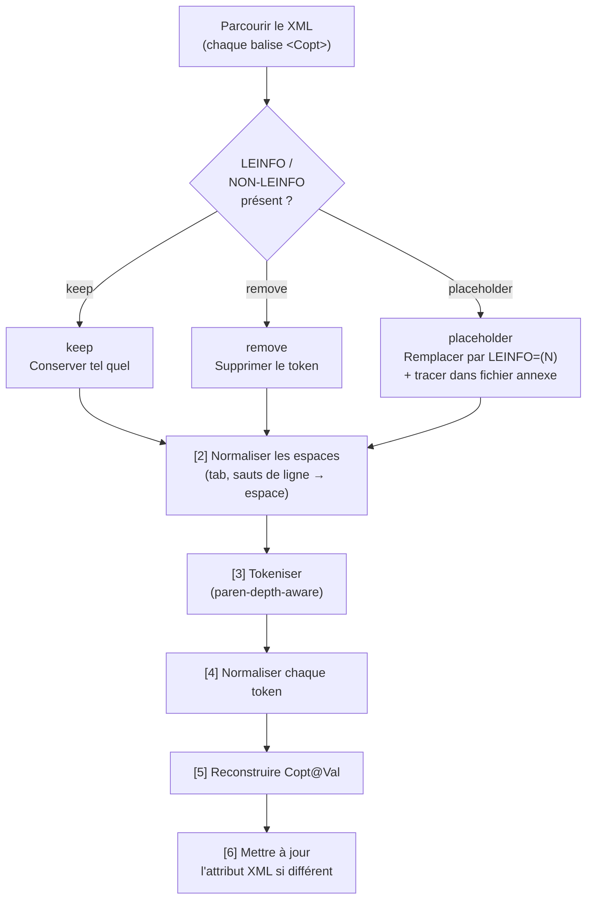

# Règles métier — `reformat_copt.py`

> **Rôle du script :** reformater l'attribut `Val` de chaque balise `<Copt>`
> dans un fichier XML VLM déjà nettoyé, de façon à rendre chaque option de
> compilation isolable par un simple `split()` en Python.

---

## Sommaire

1. [Contexte et glossaire](#1-contexte-et-glossaire)
2. [Vue d'ensemble du traitement](#2-vue-densemble-du-traitement)
2b. [Paramètres de la ligne de commande](#2b-paramètres-de-la-ligne-de-commande)
3. [Format du fichier d'entrée](#3-format-du-fichier-dentrée)
4. [Format du fichier de sortie](#4-format-du-fichier-de-sortie)
5. [Règles de reformattage de `Copt@Val`](#5-règles-de-reformattage-de-coptval)
6. [Gestion de LEINFO / NON-LEINFO](#6-gestion-de-leinfo--non-leinfo)
7. [Gestion des erreurs et codes de sortie](#7-gestion-des-erreurs-et-codes-de-sortie)
8. [Exemples concrets](#8-exemples-concrets)

---

## 1. Contexte et glossaire

`reformat_copt.py` est l'étape 2 du pipeline. Elle normalise l'attribut `Val`
de chaque balise `<Copt>` du XML pour qu'un simple `split()` puisse isoler
chaque option de compilation. Le cœur du traitement est un tokeniseur
*paren-depth-aware* : les espaces à l'intérieur de parenthèses
(`OPTION(A, B)`) ne découpent pas le token.

!!! tip "Vocabulaire"
    Pour les définitions de CSECT, COPT, LEINFO et Copt@Val, voir
    le [glossaire métier z/OS](./../glossaire.md).

---

## 2. Vue d'ensemble du traitement

Le script parcourt l'arbre XML, puis pour chaque balise `<Copt>` trouvée,
applique les étapes dans cet ordre strict :



---

## 2b. Paramètres de la ligne de commande

| Paramètre              | Obligatoire | Valeur par défaut         | Description                                           |
| ---------------------- | ----------- | ------------------------- | ----------------------------------------------------- |
| `-f` / `--file`        | non         | `datas/clean_vlm.xml`     | Fichier XML d'entrée produit par `clean_report.py`    |
| `-o` / `--output`      | non         | `datas/clean_vlm_copt.xml`| Fichier XML de sortie reformaté                       |
| `-e` / `--encoding`    | non         | `utf-8`                   | Encodage du fichier XML d'entrée                      |
| `--ignored-file`       | **OUI**     | _(aucun)_                 | Fichier de trace pour les valeurs LEINFO remplacées   |
| `--leinfo-mode`        | non         | `placeholder`             | Mode LEINFO : `placeholder`, `remove` ou `keep`       |
| `--append-ignored`     | non         | `false` (écrase)          | Ajoute au fichier de trace au lieu de l'écraser       |

> **`--ignored-file` est obligatoire** même si le mode n'est pas `placeholder`,
> car il est déclaré `required=True` dans le code. Passer un chemin quelconque
> suffit si le mode est `keep` ou `remove` (le fichier ne sera pas écrit).
>
> **`--append-ignored`** est utile pour traiter plusieurs fichiers XML en
> séquence tout en accumulant les traces LEINFO dans un fichier unique.

---

## 3. Format du fichier d'entrée

- **Encodage :** UTF-8 par défaut (paramétrable via `-e`).
- **Structure :** XML bien formé produit par `clean_report.py`.
- **Attribut cible :** `Copt@Val` — chaîne brute pouvant contenir des sauts de
  ligne, des tabulations, des espaces multiples, et des pseudo-options
  `LEINFO`/`NON-LEINFO` avec des parenthèses imbriquées.

Exemple de valeur brute :

```xml
<Copt Val="NOADV NOAWO LEINFO=(LE,NOLONGNAME,...) NOALPHA RENT"/>
```

---

## 4. Format du fichier de sortie

- **Encodage :** UTF-8 avec déclaration XML (`<?xml version='1.0' encoding='utf-8'?>`).
- **Structure XML identique** à l'entrée, seul `Copt@Val` est modifié.
- En mode `placeholder`, un fichier annexe (chemin obligatoire via `--ignored-file`)
  enregistre les valeurs originales des tokens `LEINFO`/`NON-LEINFO` remplacés,
  au format `N\tVALEUR_ORIGINALE`. Par défaut le fichier est écrasé à chaque
  exécution ; le flag `--append-ignored` permet d'y ajouter à la suite au lieu
  de le tronquer (utile pour traiter plusieurs fichiers XML successivement).

---

## 5. Règles de reformattage de `Copt@Val`

### 5.1 Normalisation des espaces

**Règle :** toute séquence de blancs (espaces, tabulations, retours à la ligne)
est remplacée par un espace unique. Les espaces en début et en fin de chaîne
sont supprimés.

> **Pourquoi ?** Les rapports IBM File Manager produisent des valeurs `Val`
> multi-lignes avec des alignements en colonnes hérités du format mainframe.
> Cette normalisation est le prérequis indispensable à la tokenisation.

```python
# src/reformat_copt.py — normalize_whitespace()
def normalize_whitespace(val: str) -> str:
    """Normalise tous les blancs (espace, tabulation, saut de ligne).

    Args:
        val: Valeur brute de `Copt@Val`.

    Returns:
        Une chaîne avec un seul espace entre les éléments.
    """
    return re.sub(r"\s+", " ", val).strip()
```

---

### 5.2 Tokenisation par profondeur de parenthèses

**Règle :** la chaîne normalisée est découpée en tokens. Un espace ne sépare
deux tokens que si la **profondeur de parenthèses vaut 0**. Les espaces
internes à une expression `OPTION(A, B)` n'initient donc pas de coupure.

> **Pourquoi ?** Une option de compilation peut contenir des sous-listes entre
> parenthèses avec des espaces internes, par exemple `CSECT(CODE, ACCPRINT)`.
> Un simple `split()` casserait ces options en plusieurs tokens erronés.

```python
# src/reformat_copt.py — tokenize_options()
def tokenize_options(val: str) -> list[str]:
    """Découpe une chaîne d'options en respectant les parenthèses imbriquées.

    Principe:
    - un espace coupe le token uniquement quand `depth == 0`,
    - dans `OPTION(A, B)`, l'espace après la virgule est donc conservé dans
      le même token jusqu'à l'étape de normalisation fine.

    Args:
        val: Chaîne d'options déjà normalisée en espaces.

    Returns:
        La liste des tokens d'options.
    """
    tokens: list[str] = []
    current: list[str] = []
    depth = 0

    for ch in val:
        if ch == "(":
            depth += 1
            current.append(ch)
            continue

        if ch == ")":
            if depth > 0:
                depth -= 1
            current.append(ch)
            continue

        if ch == " " and depth == 0:
            token = "".join(current).strip()
            if token:
                tokens.append(token)
            current = []
            continue

        current.append(ch)

    token = "".join(current).strip()
    if token:
        tokens.append(token)
    return tokens
```

---

### 5.3 Normalisation interne de chaque token

**Règle :** pour chaque token, les espaces qui suivent immédiatement une
virgule à l'intérieur des parenthèses sont supprimés.

> **Exemple :** `CSECT(CODE, ACCPRINT)` devient `CSECT(CODE,ACCPRINT)`.

> **Pourquoi ?** L'étape de tokenisation du JSON builder utilise la virgule
> comme séparateur ; les espaces parasites après virgule rendraient la
> tokenisation ultérieure ambiguë.

```python
# src/reformat_copt.py — normalize_token()
def normalize_token(token: str) -> str:
    """Supprime les espaces inutiles après virgule dans les parenthèses.

    Exemple:
        `CSECT(CODE, ACCPRINT)` devient `CSECT(CODE,ACCPRINT)`.
    """
    return re.sub(r",\s+", ",", token)
```

---

### 5.4 Pipeline complet de reformattage

Les quatre étapes précédentes sont orchestrées par `reformat_copt_value()`,
qui constitue le cœur fonctionnel du script.

```python
# src/reformat_copt.py — reformat_copt_value()
def reformat_copt_value(
    raw_val: str,
    state: ReformatState,
    ignored_writer: TextIO | None,
    leinfo_mode: str,
) -> tuple[str, int]:
    """Exécute le pipeline complet de reformattage pour un `Copt@Val`.

    Étapes:
    1. traiter `LEINFO`/`NON-LEINFO`,
    2. normaliser les blancs,
    3. tokeniser avec compteur de parenthèses,
    4. normaliser chaque token,
    5. reconstruire une chaîne à espaces simples.

    Args:
        raw_val: Valeur originale de l'attribut `Val`.
        state: État partagé du traitement.
        ignored_writer: Flux pour tracer les `LEINFO` remplacés.
        leinfo_mode: Mode appliqué aux pseudo-options `LEINFO`.

    Returns:
        `(valeur_reformatée, nombre_de_leinfo_traites)`.
    """
    value, replacements = replace_leinfo_with_placeholder(
        val=raw_val,
        state=state,
        ignored_writer=ignored_writer,
        mode=leinfo_mode,
    )
    value = normalize_whitespace(value)
    tokens = tokenize_options(value)
    normalized_tokens = [normalize_token(t) for t in tokens]
    return " ".join(normalized_tokens), replacements
```

---

### 5.5 Parcours de l'arbre XML et mise à jour sélective

**Règle :** seuls les éléments dont la valeur reformatée diffère de la valeur
originale voient leur attribut `Val` mis à jour. Les éléments inchangés ne sont
pas retouchés.

```python
# src/reformat_copt.py — reformat_tree()
def reformat_tree(
    tree: ET.ElementTree,
    leinfo_mode: str,
    ignored_writer: TextIO | None,
    logger: logging.Logger,
) -> ReformatStats:
    """Reformate en place tous les `Copt@Val` de l'arbre XML."""
    stats = ReformatStats()
    state = ReformatState()

    for copt_elem in tree.findall(".//Copt"):
        stats.total_copt += 1
        original_val = copt_elem.get("Val")

        if original_val is None:
            continue

        reformatted_val, replacements = reformat_copt_value(
            raw_val=original_val,
            state=state,
            ignored_writer=ignored_writer,
            leinfo_mode=leinfo_mode,
        )
        stats.leinfo_replaced += replacements

        if reformatted_val != original_val:
            copt_elem.set("Val", reformatted_val)
            stats.modified_copt += 1

        if not reformatted_val:
            stats.empty_after_reformat += 1

    logger.debug("Total Copt processed: %d", stats.total_copt)
    logger.debug("Copt modified: %d", stats.modified_copt)
    logger.debug("LEINFO/NON-LEINFO replaced: %d", stats.leinfo_replaced)
    logger.debug("Copt empty after reformat: %d", stats.empty_after_reformat)
    return stats
```

---

## 6. Gestion de LEINFO / NON-LEINFO

### 6.1 Nature du problème

Les pseudo-options `LEINFO=(...)` et `NON-LEINFO=(...)` peuvent contenir des
données volumineuses et des parenthèses profondément imbriquées. Elles ne sont
pas de vraies options de compilation COBOL, mais des métadonnées LE (Language
Environment). Leur traitement est configurable via `--leinfo-mode`.

### 6.2 Détection des tokens LEINFO

**Règle :** la détection s'appuie sur l'expression régulière
`(?:NON-)?LEINFO=\(` compilée avec le flag `re.IGNORECASE` (insensible à la
casse). Ainsi `LEINFO=`, `leinfo=` ou `Leinfo=` sont tous détectés. Une fois
la tête du token trouvée, la parenthèse fermante est localisée par un
algorithme d'appariement qui suit la profondeur d'imbrication.

**Comportement si les parenthèses ne sont pas équilibrées :** si un `LEINFO=(`
n'a pas de `)` correspondant (XML malformé), l'algorithme consomme jusqu'à la
fin de la chaîne. Aucune erreur n'est levée : le token est extrait jusqu'au bout.

```python
# src/reformat_copt.py — constante + helpers de détection
LEINFO_HEAD_RE = re.compile(r"(?:NON-)?LEINFO=\(", re.IGNORECASE)


def _consume_balanced_parentheses(text: str, open_index: int) -> int:
    """Trouve la parenthèse fermante qui correspond à `text[open_index]`.

    Args:
        text: Chaîne source complète.
        open_index: Position de la parenthèse ouvrante `(`.

    Returns:
        L'index juste après la parenthèse fermante correspondante.
        Si la fermeture est introuvable, renvoie `len(text)`.
    """
    depth = 0
    idx = open_index
    while idx < len(text):
        ch = text[idx]
        if ch == "(":
            depth += 1
        elif ch == ")":
            depth -= 1
            if depth == 0:
                return idx + 1
        idx += 1
    return len(text)


def _extract_leinfo_token_at(text: str, start_index: int) -> tuple[str, int] | None:
    """Extrait `LEINFO`/`NON-LEINFO` à partir d'un index donné.

    Args:
        text: Chaîne d'origine.
        start_index: Position où tenter la détection.

    Returns:
        `(token, end_index)` si un token est détecté.
        `None` sinon.
    """
    match = LEINFO_HEAD_RE.match(text, start_index)
    if not match:
        return None
    open_index = match.end() - 1
    end_index = _consume_balanced_parentheses(text, open_index)
    return text[start_index:end_index], end_index
```

### 6.3 Les trois modes de traitement

| Mode          | Comportement                                                                             | Usage recommandé                              |
| ------------- | ---------------------------------------------------------------------------------------- | --------------------------------------------- |
| `keep`        | Les tokens sont conservés sans aucune modification.                                      | Débogage, audit exhaustif                     |
| `remove`      | Les tokens sont entièrement supprimés de la chaîne reformatée.                           | Analyse des options de compilation uniquement |
| `placeholder` | Les tokens sont remplacés par `LEINFO=(N)` ou `NON-LEINFO=(N)` et tracés dans un fichier annexe. | **Mode par défaut** — compromis lisibilité/traçabilité |

**Règle (mode `placeholder`) :** chaque token remplacé reçoit un identifiant
entier `N` unique et croissant sur toute l'exécution. La valeur originale est
écrite dans le fichier annexe au format `N<TAB>VALEUR_ORIGINALE`.

> **Pourquoi un placeholder ?** `LEINFO=(...)` peut contenir plusieurs
> kilooctets de données. Le garder dans `Val` alourdit les traitements suivants
> sans apporter de valeur métier ; mais le supprimer empêche toute
> réconciliation ultérieure. Le placeholder est un compromis.

```python
# src/reformat_copt.py — replace_leinfo_with_placeholder()
def replace_leinfo_with_placeholder(
    val: str,
    state: ReformatState,
    ignored_writer: TextIO | None,
    mode: str,
) -> tuple[str, int]:
    """Traite les tokens `LEINFO`/`NON-LEINFO` selon le mode sélectionné.

    Modes disponibles:
    - `keep`: conserve les tokens sans modification.
    - `remove`: supprime entièrement ces tokens.
    - `placeholder`: remplace par `LEINFO=(N)` ou `NON-LEINFO=(N)`.

    En mode `placeholder`, la valeur originale est écrite dans
    `ignored_writer` pour permettre une résolution ultérieure.

    Args:
        val: Valeur `Copt@Val` brute.
        state: État global contenant le compteur des placeholders.
        ignored_writer: Flux texte pour tracer les valeurs remplacées.
        mode: Mode de traitement (`keep`, `remove`, `placeholder`).

    Returns:
        Un tuple `(valeur_transformée, nombre_de_remplacements)`.
    """
    if mode == "keep":
        return val, 0

    out: list[str] = []
    idx = 0
    replacements = 0

    while idx < len(val):
        extracted = _extract_leinfo_token_at(val, idx)
        if extracted is None:
            out.append(val[idx])
            idx += 1
            continue

        original_token, end_index = extracted
        replacements += 1

        if mode == "placeholder":
            state.leinfo_counter += 1
            num = state.leinfo_counter
            if ignored_writer is not None:
                ignored_writer.write(f"{num}\t{original_token}\n")
            if original_token.upper().startswith("NON-LEINFO="):
                out.append(f"NON-LEINFO=({num})")
            else:
                out.append(f"LEINFO=({num})")
        elif mode == "remove":
            # Supprime totalement le token LEINFO/NON-LEINFO.
            pass
        else:
            raise ValueError(f"Unsupported leinfo mode: {mode}")

        idx = end_index

    return "".join(out), replacements
```

---

## 7. Gestion des erreurs et codes de sortie

### 7.1 Validation des chemins avant traitement

Avant de parser le XML, le script valide les chemins d'entrée et de sortie.

| Vérification                                        | Condition d'échec        | Code de sortie |
| --------------------------------------------------- | ------------------------ | -------------- |
| Le fichier XML d'entrée existe                      | Fichier absent           | `2`            |
| Le répertoire de sortie existe et est inscriptible  | Répertoire absent ou RO  | `2`            |

La vérification des droits d'écriture repose sur la tentative de création
d'un fichier temporaire `.__copt_write_test__` immédiatement supprimé.

```python
# src/reformat_copt.py — validate_input_file() + validate_output_dir()
def validate_input_file(input_path: Path) -> None:
    """Vérifie que le fichier d'entrée existe bien."""
    if not input_path.is_file():
        raise FileNotFoundError(f"Input file '{input_path}' does not exist")


def validate_output_dir(output_path: Path) -> None:
    """Vérifie que le dossier de sortie existe et est inscriptible."""
    output_dir = (
        output_path.parent if output_path.parent != Path("") else Path(".")
    )
    if not output_dir.exists() or not output_dir.is_dir():
        raise NotADirectoryError(
            f"Output directory '{output_dir}' does not exist or is not a directory"
        )
    try:
        testfile = output_dir / ".__copt_write_test__"
        with testfile.open("w", encoding="utf-8"):
            pass
        testfile.unlink()
    except OSError as exc:
        raise PermissionError(
            f"Output directory '{output_dir}' is not writable"
        ) from exc
```

### 7.2 Tableau récapitulatif des codes de sortie

| Code | Signification                                                                         |
| ---- | ------------------------------------------------------------------------------------- |
| `0`  | Succès — le fichier XML reformaté a été produit correctement.                         |
| `2`  | Erreur fichier/répertoire — fichier d'entrée absent, répertoire de sortie inaccessible. |
| `3`  | Erreur de parsing XML — le fichier d'entrée n'est pas un XML valide.                  |
| `10` | Erreur E/S — erreur de lecture ou d'écriture lors du traitement.                      |

```python
# src/reformat_copt.py — gestion des codes de sortie dans main()
    except (FileNotFoundError, NotADirectoryError, PermissionError) as exc:
        LOGGER.error("%s", exc)
        sys.exit(2)
    except ET.ParseError as exc:
        LOGGER.error("XML parse error: %s", exc)
        sys.exit(3)
    except OSError as exc:
        LOGGER.error("I/O error: %s", exc)
        sys.exit(10)
```

---

## 8. Exemples concrets

### 8.1 Normalisation des espaces

Entrée brute (avec saut de ligne et tabulation) :

```
NOADV\n\tNOAWO\t\tRENT  NOALPHA
```

Après `normalize_whitespace()` :

```
NOADV NOAWO RENT NOALPHA
```

---

### 8.2 Tokenisation avec parenthèses imbriquées

Entrée :

```
NOADV CSECT(CODE, ACCPRINT) RENT
```

Après `tokenize_options()` :

```python
["NOADV", "CSECT(CODE, ACCPRINT)", "RENT"]
```

Après `normalize_token()` sur chaque token :

```python
["NOADV", "CSECT(CODE,ACCPRINT)", "RENT"]
```

Résultat final reconstruit :

```
NOADV CSECT(CODE,ACCPRINT) RENT
```

---

### 8.3 Mode `placeholder`

Entrée `Copt@Val` :

```
RENT LEINFO=(LE,NOLONGNAME,RMODE=ANY) NOOPT
```

Après traitement (mode `placeholder`, premier remplacement) :

- `Copt@Val` mis à jour :

  ```
  RENT LEINFO=(1) NOOPT
  ```

- Ligne ajoutée dans `datas/copt_ignored.txt` :

  ```
  1	LEINFO=(LE,NOLONGNAME,RMODE=ANY)
  ```

---

### 8.4 Mode `remove`

Entrée `Copt@Val` :

```
RENT LEINFO=(LE,NOLONGNAME,RMODE=ANY) NOOPT
```

Après traitement (mode `remove`) :

```
RENT  NOOPT
```

Puis après `normalize_whitespace()` :

```
RENT NOOPT
```

---

### 8.5 Mode `keep`

Entrée `Copt@Val` :

```
RENT LEINFO=(LE,NOLONGNAME,RMODE=ANY) NOOPT
```

Après traitement (mode `keep`) — aucune modification du token LEINFO,
seule la normalisation des blancs et des virgules est appliquée :

```
RENT LEINFO=(LE,NOLONGNAME,RMODE=ANY) NOOPT
```

---

### 8.6 NON-LEINFO en mode `placeholder`

Entrée :

```
NOOPT NON-LEINFO=(DATA,NOLONGNAME) RENT
```

Après traitement (deuxième occurrence globale dans le fichier) :

- `Copt@Val` mis à jour :

  ```
  NOOPT NON-LEINFO=(2) RENT
  ```

- Ligne ajoutée dans `datas/copt_ignored.txt` :

  ```
  2	NON-LEINFO=(DATA,NOLONGNAME)
  ```
